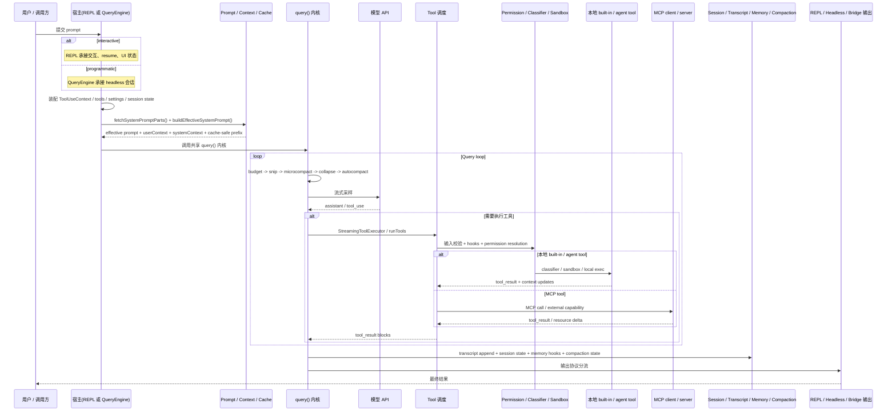

# Claude Code Source 全量工程分析报告

生成时间：2026-04-02  
最近同步时间：2026-04-03 16:49:54 +0800  
分析范围：`/root/claude-code-source-code`  
分析方式：主线程通读关键源码 + 2 个 `gpt-5.4` 子分析线程交叉审阅  
约束说明：本轮只做静态分析与文档沉淀，不修改业务代码，不做 debug/修复

## 1. 执行摘要

这不是一个“普通 CLI 工具源码仓”，而是一个把 CLI/TUI、headless SDK、Prompt 编排、Tool 执行、权限治理、沙箱、MCP 生态、Subagent/Team、上下文压缩、远程控制、遥测与远程策略全部装进同一运行时内核的 agent 平台。

从工程结构看，真正的系统控制面主要有六条：

1. `feature()` / `MACRO.*` / Bun 编译期裁剪。
2. `main.tsx` + `entrypoints/*` 的启动分流与模式装配。
3. `query.ts` + `QueryEngine.ts` 的统一会话执行内核。
4. `prompts.ts` + `context.ts` + `utils/api.ts` 的 prompt/cache 前缀构建。
5. `Tool.ts` + `tools.ts` + `services/tools/*` 的工具协议与调度。
6. `permissions/*` + `sandbox/*` + `services/mcp/*` 的安全边界与外部能力接入。

这套工程最强的地方不是“功能多”，而是已经形成了比较明确的平台级设计意图：

- Prompt cache 被当成一级性能指标来设计，不是 API 附带优化。
- Subagent 不是 prompt 模板，而是二级 runtime。
- MCP 不是插件边角，而是一等外部能力接入层。
- 权限不是单层 allow/deny，而是规则、classifier、hook、沙箱、运行模式叠加的决策链。
- headless/SDK 不是简化版，而是和 REPL 并列的一等运行面。

同时，它的主要风险也很明确：

- `src/main.tsx`、`src/screens/REPL.tsx`、`src/query.ts`、`src/tools/AgentTool/*`、`src/services/mcp/*` 已经出现超级枢纽化。
- 许多“行为正确性”依赖跨文件的隐式契约，尤其是 prompt cache、fork subagent、权限路径语义、MCP 去重、session restore。
- 这是一个“用于研究的反编译/解包源码视图”，不是官方原始研发仓；构建与运行行为不能无条件等同于 Anthropic 内部真实构建链。

## 2. 仓库画像与可信边界

### 2.1 基本画像

- 包名：`@anthropic-ai/claude-code-source`
- 版本：`2.1.88`
- `src` 文件数：约 `1902`
- 主要子目录文件数：
  - `utils`: 564
  - `components`: 389
  - `commands`: 207
  - `tools`: 184
  - `services`: 130
- 关键超大文件：
  - `src/cli/print.ts`: 5594 LOC
  - `src/main.tsx`: 4683 LOC
  - `src/services/mcp/auth.ts`: 2465 LOC
  - `src/query.ts`: 1729 LOC
  - `src/QueryEngine.ts`: 1295 LOC
  - `src/constants/prompts.ts`: 914 LOC
  - `src/Tool.ts`: 792 LOC

### 2.2 这是“研究用源码视图”，不是官方原始仓

`package.json` 直接把自己定义为研究用途的反编译源码：

```json
{
  "name": "@anthropic-ai/claude-code-source",
  "version": "2.1.88",
  "description": "Claude Code v2.1.88 — decompiled source for research"
}
```

文件：`package.json`

`README.md` 与 `QUICKSTART.md` 也明确说明：

- npm 发布物原本是单一 bunded `cli.js`
- 当前 `src/` 是“从 npm 包中提取/解包的 TypeScript 源码”
- 完整重建依赖 Bun 的编译期 intrinsic，如 `feature()`、`MACRO.*`、`bun:bundle`

### 2.3 构建链不是等价重建

`scripts/build.mjs` 说得非常直白：这是 best-effort build，不是官方原生构建。

```js
/**
 * ⚠️ IMPORTANT: A complete rebuild requires the Bun runtime's compile-time
 * intrinsics (feature(), MACRO, bun:bundle). This script provides a
 * best-effort build using esbuild.
 */
```

更关键的是，它会直接把 `feature('X')` 替换为 `false`，并自动补 stub：

```js
// 2a. feature('X') → false
if (/\bfeature\s*\(\s*['"][A-Z_]+['"]\s*\)/.test(src)) {
  src = src.replace(/\bfeature\s*\(\s*['"][A-Z_]+['"]\s*\)/g, 'false')
  changed = true
}
```

文件：`scripts/build.mjs`

这意味着：

- 外部分析仓中看到的功能树，和 Anthropic 内部真实 build 里保留下来的功能树不一定一致。
- 很多 `feature()` 分支对应的模块根本不在发布包里，而是发布时已经 DCE 掉了。
- 不能把“这个仓库里缺少某个实现”直接理解为产品没有这个能力。

### 2.4 `prepare-src.mjs` 直接 patch `src/`

这是一个很容易被忽略的点。

`scripts/prepare-src.mjs` 不是在副本上变换，而是直接遍历并 patch `src/`：

```js
const ROOT = path.resolve(__dirname, '..')
const SRC = path.join(ROOT, 'src')
...
for (const file of files) {
  if (patchFile(file)) {
    patched++
  }
}
```

文件：`scripts/prepare-src.mjs`

这至少带来两个结论：

- 如果执行过 `prepare-src.mjs`，当前仓库中的 `src/` 就可能偏离“最初解包出的原始快照”。
- 本节已经可以确认的，不是“它现在一定改过”，而是“这个仓库具备直接原地改写 `src/` 的机制”；因此它同时承载“分析视图”和“重建试验视图”，边界并不绝对干净。

## 3. 总体架构判断

### 3.1 真正的拓扑不是“CLI -> API”

更准确的描述应该是：

`入口分流 -> 初始化/策略装配 -> prompt/cache 前缀构建 -> query 内核 -> tool/permission/sandbox -> MCP/agent/skills -> transcript/memory/compaction -> 输出面(REPL/headless/bridge)`

这里不是作者主观喜欢把一条链写长，而是源码里这些节点确实各自形成了一层“一级边界”：

- `prompt/cache 前缀构建` 要单列，因为它在进入 `query()` 之前就已经影响 system blocks、tool schema 和 cache-safe 字节前缀。
- `query 内核` 要单列，因为上下文治理、流式采样、tool loop、follow-up query 都在这里统一发生。
- `tool/permission/sandbox` 要单列，因为模型一旦发出 `tool_use`，执行路径立刻进入另一套策略与安全栈，已经不是“继续跑 prompt”。
- `输出面` 要单列，因为 REPL、headless、bridge 共享 query 内核，但宿主协议、UI 能力、恢复/交互方式并不相同。

所以更短地说：这套系统当然可以被压扁成“CLI 调 API”，但那样会把真正决定 cache、权限、工具和运行面差异的结构全部压没。

### 3.2 可以把系统分成 8 个一级子系统

这里的 8 层更适合作为“分析框架”来理解，而不是把它误读成仓库内部明示的一张官方架构图。源码里的边界并不完全干净，尤其 `Query / Tool / Permission / Agent` 之间存在明显交叠。

先把最容易误导读者的三点钉死：

- REPL 与 `QueryEngine` 是并列宿主，二者都把请求送进共享 `query()` 内核；不能把主链画成 `REPL -> QueryEngine`。
- Prompt / Context / Cache 前缀发生在 `query()` 之前，不是进入模型 API 时才临时拼出来的附属细节。
- Tool 安全链、MCP、Bridge / Remote Control、Session / Memory / Compaction 是相邻边界，不是一层“大杂烩运行时”。

```mermaid
flowchart TD
    A[CLI / REPL 宿主] --> D[宿主装配 / Session 恢复]
    B[Headless 宿主 / QueryEngine] --> D
    D --> E[Prompt / Context / Cache Prefix]
    E --> F[query() 内核]
    F --> G[Tool 调度 / Agent Loop]
    G --> H[Permission / pre-tool hooks]
    H --> I[Classifier / Sandbox / 本地执行]
    G -.可见工具池来自.-> J[MCP 配置 / 连接 / tool/resource 暴露]
    F --> K[Transcript 链 / Session 持久化]
    K --> L[Memory / Collapse / Compaction]
    F --> M[REPL / Headless / Bridge 输出协议]
    N[Bridge / Remote Control 运行面] -.接续 / 控制本地会话.-> M
```

这张图表达的是“一级边界和主信息流”，不是源码里一条严格单向的调用栈；但它至少把后文最关键的宿主并列关系和安全边界关系画对了。

和后文章节的对应关系可以直接这样读：

- 第 `6/7` 章主要展开 `宿主装配 -> Prompt / Context / Cache -> query()`
- 第 `8/9/10/11` 章主要展开 `query() -> Tool 调度 -> Permission / Sandbox / Agent`
- 第 `12` 章主要展开 `MCP` 与 `Bridge / Remote Control` 的外部边界
- 第 `13` 章主要展开 `Transcript / Session / Memory / Compaction`

1. 启动与运行面分流
2. Prompt / Context / API 前缀构建
3. Query 执行内核
4. Tool 协议与工具调度
5. Agent / Skill / Fork / Team
6. Permission / Classifier / Sandbox
7. MCP 配置、连接、鉴权与模型暴露面
8. Persistence / Session / Memory / Telemetry / Remote policy

### 3.3 几个“文件名低估职责”的例子

- `src/constants/prompts.ts` 不只是常量文件；它同时承载 `SYSTEM_PROMPT_DYNAMIC_BOUNDARY`、prompt section registry 和 system prompt 主体组装。
- `src/screens/REPL.tsx` 不只是 UI 文件；它同时承载 permission 交互、session restore、MCP/tool 面增量管理等交互式 runtime 外壳职责。
- `src/QueryEngine.ts` 不只是“另一个引擎”；它主要是 headless 会话宿主，用来把程序化调用形态接到共享 query 内核上。
- `src/tools.ts` 不只是工具列表；它负责 built-in 工具全集、session 裁剪、MCP 合并、稳定排序和最终模型可见工具池装配。
- `src/utils/config.ts` 不只是 config parser；它同时负责多层设置读写、来源追踪、优先级合并和一部分全局状态持久化。

## 4. 启动链路与运行面架构

## 4.1 `src/entrypoints/cli.tsx`：轻量外层分发器

`cli.tsx` 的职责很克制：它优先处理极少数 fast path，尽量减少冷启动模块加载。

典型例子是 `--version`：

```ts
if (args.length === 1 && (args[0] === '--version' || args[0] === '-v' || args[0] === '-V')) {
  console.log(`${MACRO.VERSION} (Claude Code)`);
  return;
}
```

文件：`src/entrypoints/cli.tsx`

但这个文件并不只是轻量路由，它还承担了一个非常关键的编译期职责：有些环境变量必须在 import 前决定，因为下游模块会在模块初始化时捕获它们。

```ts
// Harness-science L0 ablation baseline. Inlined here (not init.ts) because
// BashTool/AgentTool/PowerShellTool capture DISABLE_BACKGROUND_TASKS into
// module-level consts at import time — init() runs too late.
```

文件：`src/entrypoints/cli.tsx`

这说明它不是普通的 `main()`，而是一个“带编译期/模块初始化约束的启动入口”。

### 4.2 `src/entrypoints/init.ts`：安全初始化层

`init.ts` 的作用不是起业务，而是先把“可以安全做、必须尽早做”的事情完成：

- `enableConfigs()`
- `applySafeConfigEnvironmentVariables()`
- CA cert / mTLS / proxy
- remote managed settings / policy promise 初始化
- graceful shutdown
- OAuth account info 预热
- JetBrains / Git 仓库检测
- upstream proxy（CCR 场景）
- scratchpad 目录初始化

关键片段：

```ts
applySafeConfigEnvironmentVariables()
applyExtraCACertsFromConfig()
setupGracefulShutdown()
...
if (isEligibleForRemoteManagedSettings()) {
  initializeRemoteManagedSettingsLoadingPromise()
}
if (isPolicyLimitsEligible()) {
  initializePolicyLimitsLoadingPromise()
}
```

文件：`src/entrypoints/init.ts`

这里体现的是“信任建立前后的分层初始化”。

### 4.3 `src/main.tsx`：真正的系统编排根

`main.tsx` 才是整套系统的实控中心。它要做的事包括：

- argv 改写与模式识别
- interactive / non-interactive 分流
- commander 命令树构建
- `preAction` 统一初始化
- migration
- inline plugin 目录绑定
- remote managed settings / policy limits 热加载
- 默认 action 对 REPL 或 headless 的跳转

`preAction` 是这个文件里最关键的隐藏节点：

```ts
program.hook('preAction', async thisCommand => {
  await Promise.all([ensureMdmSettingsLoaded(), ensureKeychainPrefetchCompleted()]);
  await init();
  ...
  const { initSinks } = await import('./utils/sinks.js');
  initSinks();
  ...
  runMigrations();
  void loadRemoteManagedSettings();
  void loadPolicyLimits();
})
```

文件：`src/main.tsx`

这一层的设计意图很明确：避免子命令绕开关键初始化。

### 4.4 `--settings` 的 content-hash 路径是 cache 设计的一部分

这是一个特别典型的“跨模块隐式契约”。

```ts
// Use a content-hash-based path instead of random UUID to avoid
// busting the Anthropic API prompt cache.
settingsPath = generateTempFilePath('claude-settings', '.json', {
  contentHash: trimmedSettings
});
```

文件：`src/main.tsx`

原因不是“文件路径美观”，而是：

- settings 路径会进入 Bash sandbox deny list
- deny list 又会进入 tool description
- tool description 会被送进 API prompt 前缀
- 如果路径每次都随机，prompt cache prefix 就会被持续打爆

这里的 `content hash` 不是维护一张映射表，而是做了一个确定性函数映射。`src/utils/tempfile.ts` 的实现是：

```ts
const id = options?.contentHash
  ? createHash('sha256')
      .update(options.contentHash)
      .digest('hex')
      .slice(0, 16)
  : randomUUID()
return join(tmpdir(), `${prefix}-${id}${extension}`)
```

文件：`src/utils/tempfile.ts`

这意味着：

- 输入是 `trimmedSettings` 这段 settings 原文
- 系统会对它做 `SHA-256`
- 取十六进制结果前 `16` 位作为稳定标识
- 最终路径形态类似：`/tmp/claude-settings-<16位hash>.json`

相同内容永远映射到相同路径，不同内容才会映射到不同路径。这个路径不是为了“可读性”，而是为了“模型可见字节稳定性”。

这条链路在源码里是闭环的：

1. `main.tsx` 把 `--settings` 的 JSON 内容写到 content-hash 命名的临时文件。
2. sandbox 配置会把相关路径带进 Bash 的文件系统限制描述。
3. `src/tools/BashTool/prompt.ts` 会把 `denyWithinAllow` 等限制序列化进 BashTool 的 prompt 文本。
4. `src/utils/api.ts` 在生成 API tool schema 时，使用的是 `await tool.prompt(...)` 的结果，而不是短说明。
5. 于是 BashTool prompt 的字节变化，会直接影响送给模型的 tool description，进而影响 API prompt cache 前缀。

其中第 3、4 步的关键代码分别在：

```ts
const filesystemConfig = {
  read: {
    denyOnly: dedup(fsReadConfig.denyOnly),
    ...(fsReadConfig.allowWithinDeny && {
      allowWithinDeny: dedup(fsReadConfig.allowWithinDeny),
    }),
  },
  write: {
    allowOnly: normalizeAllowOnly(fsWriteConfig.allowOnly),
    denyWithinAllow: dedup(fsWriteConfig.denyWithinAllow),
  },
}
```

文件：`src/tools/BashTool/prompt.ts`

```ts
base = {
  name: tool.name,
  description: await tool.prompt({
    getToolPermissionContext: options.getToolPermissionContext,
    tools: options.tools,
    agents: options.agents,
    allowedAgentTypes: options.allowedAgentTypes,
  }),
  input_schema,
}
```

文件：`src/utils/api.ts`

为什么说这件事最体现“工程味道”：

- 它优化的不是本地代码写法，而是最终 API 成本和 cache 命中率这个系统级指标。
- 它定位的是“真正进入模型前缀的那一层字节”，不是停留在 CLI 参数处理表面。
- 它考虑的是跨进程稳定性。注释已经写明，SDK 的每次 `query()` 可能都会起新进程，所以随机 UUID 会让完全相同的 settings 在每次调用里都变成不同 prompt 前缀。
- 它没有为了性能破坏现有安全/功能路径，而是在保留“真实临时文件 + 现有 sandbox 机制”的前提下，把随机名改成稳定名，属于低侵入但高收益的修正。

记忆锚点可以压缩成一句话：

> 这里优化的不是“临时文件名”，而是“模型看到的工具描述字节稳定性”；真正被保护的是 prompt cache，而不是文件系统美观。

## 5. 多运行面：CLI、REPL、Headless、Bridge

### 5.1 这套系统至少有 4 类运行面

1. CLI fast path
2. Interactive REPL / Ink TUI
3. Headless / SDK / structured IO
4. Bridge / Remote Control / background / daemon 类运行面

### 5.2 Interactive REPL 不是“聊天界面”

`src/screens/REPL.tsx` 虽然名字叫 screen，但实际承担了大量 runtime orchestration：

- AppState 与消息流
- 权限弹窗
- MCP 连接与增量工具面
- slash command
- IDE 集成
- background tasks
- session restore
- notifications
- input/output flow

因此它本质上更像“交互 runtime shell”，不是纯展示组件。

### 5.3 Headless 不是降级模式

`src/QueryEngine.ts` 不是另一套模型引擎，而是 headless host。

它负责：

- 会话级 mutable messages
- permission denial 跟踪
- systemPrompt/userContext/systemContext 构建
- structured output tool 跟踪
- transcript persistence
- replay 与 SDK 输出标准化

核心关系是：

- REPL 路径与 headless 路径共享底层 `query()`
- 区别主要在宿主层状态管理、交互能力与输出协议

## 6. 端到端请求生命周期

从“用户输入一句话”到“系统返回结果”，主链路可以概括为：

这一节只保留“实际主链”。如果旧图把它简化成 `REPL -> QueryEngine -> query()`，那种画法最多只能表达“交互宿主与 headless 宿主共享一部分运行时逻辑”，不能当作真实执行链。



这张图有两个故意保留的边界：

- `Prompt / Context / Cache` 是进入 `query()` 之前的主线，不再缺席。
- `Permission / Classifier / Sandbox` 与 `MCP` 分开画，因为二者分别对应本地安全链和外部能力接入层；`Bridge` 只在输出/会话控制面出现，不属于 tool 执行层。

1. 用户从 REPL 宿主或 headless 宿主（通常由 `QueryEngine` 承接）提交 prompt。
2. 宿主层先恢复或装配 `ToolUseContext`、tool pool、commands、MCP state、settings、session state。
3. `fetchSystemPromptParts()` 取 `defaultSystemPrompt + userContext + systemContext`。
4. `buildEffectiveSystemPrompt()` 决定最终使用默认 prompt、custom prompt、agent prompt 还是 coordinator prompt，并形成 cache-safe 前缀。
5. 宿主层调用共享 `query()` 主循环。
6. query 对历史消息做 `tool result budget -> snip -> microcompact -> context collapse -> autocompact`。
7. 调用模型流式采样。
8. 流式收集 assistant message 和 `tool_use` blocks。
9. 通过 `StreamingToolExecutor` 或 `toolOrchestration.runTools()` 执行工具。
10. 工具执行通常先进入统一执行壳；其中输入校验、pre-tool hooks、permission resolution 是主干；本地工具才继续命中 classifier / sandbox，MCP 工具则走独立外部能力链路。
11. 工具结果被归并回消息链，必要时继续 follow-up query。
12. transcript、session state、session memory、compact state、usage、notifications 分别落地。
13. 按 REPL/headless/bridge 各自协议输出。

这条链路的关键是：它不是“请求一次模型，跑一下工具”。它是一个持续治理上下文、权限、缓存、持久化和执行反馈的 agent loop。

## 7. Prompt / Context / Cache 架构

## 7.1 `prompts.ts` 的真实定位

`src/constants/prompts.ts` 最大的误导是名字。它不是 prompt 常量表，而是 prompt 编排器。

最关键常量：

```ts
export const SYSTEM_PROMPT_DYNAMIC_BOUNDARY =
  '__SYSTEM_PROMPT_DYNAMIC_BOUNDARY__'
```

文件：`src/constants/prompts.ts`

它后面跟着明确警告：

- 不要移动或删除这个 marker
- `src/utils/api.ts`
- `src/services/api/claude.ts`

都依赖它来切分缓存边界

### 7.2 `getSystemPrompt()` 的结构是“静态 prefix + 动态 section registry”

主 prompt 的构造模式：

```ts
return [
  getSimpleIntroSection(outputStyleConfig),
  getSimpleSystemSection(),
  ...,
  ...(shouldUseGlobalCacheScope() ? [SYSTEM_PROMPT_DYNAMIC_BOUNDARY] : []),
  ...resolvedDynamicSections,
].filter(s => s !== null)
```

文件：`src/constants/prompts.ts`

这里的架构意义非常强：

- 静态部分用于跨用户/跨会话缓存
- 动态部分包含 session-specific 内容，避免污染全局 cache prefix

### 7.3 `systemPrompt` 不是唯一来源，`userContext`/`systemContext` 也是 cache prefix 一部分

`src/utils/queryContext.ts` 写得非常明确：

```ts
/**
 * Shared helpers for building the API cache-key prefix
 * (systemPrompt, userContext, systemContext) for query() calls.
 */
```

文件：`src/utils/queryContext.ts`

这意味着：分析 prompt 不能只看 `prompts.ts`，还必须看：

- `src/context.ts`
- `src/utils/queryContext.ts`
- `src/utils/systemPrompt.ts`

### 7.4 `getSystemContext()` 的 git status 是会话快照，不是实时观察

`context.ts` 明写：

```ts
return [
  `This is the git status at the start of the conversation. Note that this status is a snapshot in time, and will not update during the conversation.`,
  ...
].join('\n\n')
```

文件：`src/context.ts`

这点非常关键。很多人会误以为 Claude 始终看到最新 git 状态，但这里明确只是会话启动时的快照。

### 7.5 effective system prompt 还有多级优先级

`src/utils/systemPrompt.ts` 定义了真正的 prompt 选择逻辑：

源码注释里的优先级可以直接读成：

1. `overrideSystemPrompt`：最高优先级，直接替换全部其他 prompt。
2. `Coordinator system prompt`：协调器模式开启且主线程没有 agent 时生效。
3. `Agent system prompt`：如果主线程绑定了 agent，则优先使用 agent prompt。
4. `customSystemPrompt`：用户显式传入的自定义 prompt。
5. `defaultSystemPrompt`：默认 Claude Code system prompt。

这里真正重要的不是“有 5 档优先级”，而是它说明 effective system prompt 并不是简单在 `prompts.ts` 里一次拼完，而是会在运行时根据 coordinator / agent / custom / override 等状态再做一次选择。

而且 proactive 模式下 agent prompt 是 append，不是 replace：

```ts
if (agentSystemPrompt && ... isProactiveActive_SAFE_TO_CALL_ANYWHERE()) {
  return asSystemPrompt([
    ...defaultSystemPrompt,
    `\n# Custom Agent Instructions\n${agentSystemPrompt}`,
    ...(appendSystemPrompt ? [appendSystemPrompt] : []),
  ])
}
```

文件：`src/utils/systemPrompt.ts`

记忆锚点：

> `prompts.ts` 负责“生产默认 prompt”，`systemPrompt.ts` 负责“决定这次最终到底用哪份 prompt”。

### 7.6 API 层会再次把 system prompt 转成 cache-control block

`src/utils/api.ts` 的 `splitSysPromptPrefix()` 再次把 prompt 拆成不同 cache scope：

```ts
if (staticJoined)
  result.push({ text: staticJoined, cacheScope: 'global' })
if (dynamicJoined)
  result.push({ text: dynamicJoined, cacheScope: null })
```

文件：`src/utils/api.ts`

`src/services/api/claude.ts` 则最终转成 API block：

```ts
return splitSysPromptPrefix(systemPrompt, {
  skipGlobalCacheForSystemPrompt: options?.skipGlobalCacheForSystemPrompt,
}).map(block => {
  return {
    type: 'text' as const,
    text: block.text,
    ...(enablePromptCaching &&
      block.cacheScope !== null && {
        cache_control: getCacheControl({
          scope: block.cacheScope,
          querySource: options?.querySource,
        }),
      }),
  }
})
```

文件：`src/services/api/claude.ts`

这进一步证明：Prompt 架构和 API cache 架构是一套东西，不是两个独立子系统。

### 7.7 组合后的 prompt 模板

把 `prompts.ts`、`systemPrompt.ts`、`queryContext.ts`、`context.ts` 和 API 层拼在一起，可以把一次请求实际经历的 prompt 组合过程理解成下面这个模板：

```text
[第 1 层：默认 prompt 生产层]
defaultSystemPrompt =
  静态前缀：
    Intro
    System
    Doing tasks
    Actions
    Using your tools
    Tone and style
    Output efficiency
  + （可选）SYSTEM_PROMPT_DYNAMIC_BOUNDARY
  + 动态后缀：
    session_guidance
    memory
    ant_model_override
    env_info
    language
    output_style
    mcp_instructions
    scratchpad
    frc
    summarize_tool_results
    ...

[第 2 层：effective prompt 选择层]
effectiveSystemPrompt =
  overrideSystemPrompt
  or coordinatorSystemPrompt
  or agentSystemPrompt
  or customSystemPrompt
  or defaultSystemPrompt
  + appendSystemPrompt

[第 3 层：cache-key prefix 组合层]
queryPrefix =
  effectiveSystemPrompt
  + userContext
  + systemContext

[第 4 层：API block 转换层]
apiSystemBlocks =
  attribution header
  + CLI system prompt prefix
  + static blocks (global/org cache)
  + dynamic blocks (uncached)
```

如果再压缩成一句更好记的话：

- `prompts.ts` 负责“生产默认 prompt 原料”
- `systemPrompt.ts` 负责“决定这次最终采用哪份 prompt”
- `queryContext.ts` / `context.ts` 负责“把 user/system context 一起拼进 cache-key prefix”
- `utils/api.ts` / `services/api/claude.ts` 负责“把这份 prefix 再切成 API 可缓存的 block”

这个模板的意义是：以后再看 prompt 相关问题时，不要只盯着 `prompts.ts`。真正决定模型最终看到什么，要至少沿着这 4 层一起看。

再给一个“组合完成后的示意结果”，帮助把抽象模板落地。下面不是仓库里的真实 prompt 全文，而是一个结构上等价、便于记忆的示意例子：

```text
场景假设：
- 当前是 proactive 模式
- 主线程绑定了一个 agent
- 用户额外传了 appendSystemPrompt
- userContext 里有 CLAUDE.md 摘要
- systemContext 里有 gitStatus 快照

[A. 默认 prompt 原料：来自 prompts.ts]
defaultSystemPrompt = [
  "# Intro ...",
  "# System ...",
  "# Doing tasks ...",
  "# Actions ...",
  "# Using your tools ...",
  "# Tone and style ...",
  "# Output efficiency ...",
  "__SYSTEM_PROMPT_DYNAMIC_BOUNDARY__",
  "# Session-specific guidance ...",
  "# Memory ...",
  "# Environment info ...",
  "# MCP Server Instructions ...",
]

[B. effective prompt：来自 systemPrompt.ts]
effectiveSystemPrompt = [
  ...defaultSystemPrompt,
  "# Custom Agent Instructions\nYou are the review agent for ...",
  "Please keep the final answer under 200 words unless I ask for more.",
]

[C. 进入 query() 之后的最终请求骨架]
systemPromptForModel = [
  ...effectiveSystemPrompt,
  "gitStatus: This is the git status at the start of the conversation ...",
]

messagesForModel = [
  user(meta):
    <system-reminder>
    As you answer the user's questions, you can use the following context:
    # claudeMd
    ...
    IMPORTANT: this context may or may not be relevant ...
    </system-reminder>,
  user(actual): "请帮我分析这个模块",
  assistant/history/tool_result ...
]

[D. API 层真正发送的 system blocks：来自 utils/api.ts + services/api/claude.ts]
apiSystemBlocks = [
  { text: "x-anthropic-billing-header: ...", cacheScope: null },
  { text: "CLI system prompt prefix", cacheScope: null 或 org },
  { text: "静态前缀合并块", cacheScope: global 或 org },
  { text: "动态后缀 + systemContext", cacheScope: null 或 org },
]
```

这个例子里最容易记错的点有两个：

1. `userContext` 不是 append 到 system prompt 尾部，而是作为一个额外的 meta user message 插进 messages 最前面。
2. `systemContext` 才是 append 到 system prompt 尾部的那部分，会和 prompt 本体一起进入 system blocks 的切分流程。

#### 7.7.1 按阅读视角看到的 system prompt 主体模板

```text
# 简介
你是一个交互式代理，旨在协助用户处理软件工程任务。请使用下述指令及可用工具为用户提供帮助。你必须永远不要为用户生成或猜测 URL，除非你确信这些 URL 是为了帮助用户进行编程。

# 系统规则
交互方式：你在工具调用之外输出的所有文本都会显示给用户。你可以使用 GitHub 风格的 Markdown 进行格式化。

权限模式：工具在用户选择的权限模式下执行。如果用户拒绝了某个工具调用，请不要尝试重复完全相同的调用，而应思考原因并调整方法。

自动压缩：系统会在对话接近上下文限制时自动压缩之前的消息。这意味着对话不受单一上下文窗口的限制。

# 执行任务规范
拒绝过度开发：不要添加未要求的特性、重构代码或进行“改进”。简单功能的实现不需要额外的可配置性。

注释准则：不要为你没有更改的代码添加文档字符串、注释或类型注解。仅在逻辑不直观时添加注释。

复杂度控制：不要为不可能发生的场景创建助手、工具函数或抽象。三行相似的代码好过一个不成熟的抽象。

安全第一：注意不要引入命令注入、XSS、SQL 注入等安全漏洞。如果你发现编写了不安全的代码，请立即修复。

忠实报告：诚实地报告结果。如果测试失败，请结合相关输出说明情况；如果你没有运行验证步骤，请如实告知，而非暗示其已成功。

# 操作风险控制
在执行操作前，请仔细考虑其可逆性和影响范围。对于难以逆转、影响本地环境之外的共享系统或具有破坏性的操作（如 rm -rf、强制推送、删除分支、修改 CI/CD 管道等），必须先征得用户确认。

# 工具使用规范
专用工具优先：严禁在有专用工具的情况下使用 bash 运行命令。

使用 read_file 代替 cat 或 sed。

使用 edit_file 代替 sed 或 awk。

使用 write_file 代替 echo 重定向。

并行调用：尽可能并行调用互不依赖的工具以提高效率。如果存在依赖关系，则必须按顺序调用。

# 语气与风格
禁止表情：除非用户明确要求，否则不要在所有沟通过程中使用表情符号。

代码引用：引用特定函数或代码片段时，请包含 file_path:line_number 模式，以便用户导航。

简洁明了：不要在工具调用前使用冒号。例如，应使用“让我读取文件。”而非“让我读取文件：”。

# 输出效率
直奔主题。尝试用最简单的方法，不要绕圈子。文本输出应保持简短直接，优先提供答案或行动，而非推理过程。如果你能用一句话说明，就不要用三句。

__SYSTEM_PROMPT_DYNAMIC_BOUNDARY__

# 环境信息
你已被调用至以下环境：

当前工作目录: /home/user/project

Git 仓库状态: 是

平台: Linux

Shell: bash

操作系统版本: Linux 6.6.4

模型信息: 你由 Claude Opus 4.6 模型驱动。该模型的 ID 为 claude-opus-4-6。

知识截止日期: 2025 年 5 月。

# 语言设置
始终使用 中文 (Chinese) 进行回复。对所有解释、注释和与用户的沟通使用中文，但技术术语和代码标识符应保持其原始形式。
```

注意：这一段仍然只对应“最终请求里的 system prompt 主体”。真正发给模型的完整输入，还会像 `7.7` 开头那样继续叠加 `systemContext`，并把 `userContext` 作为一个额外的 meta user message 插到 messages 最前面。

#### 7.7.2 按 API 传输层看到的最终结果

如果继续往下一层，看 Anthropic API 真正收到的“线上的请求形态”，它又不会是上面那种单一长字符串，而会近似变成：

```text
system blocks:
1. attribution / billing header
2. CLI 固定 system 前缀
3. 可缓存静态 system 块
   = defaultSystemPrompt + agent/custom/append 等稳定部分
4. 动态 system 块
   = systemContext，例如 gitStatus

messages:
1. meta user message
   = userContext，例如 CLAUDE.md 摘要
2. actual user message
   = "请帮我分析这个模块"
3. assistant/history/tool_result ...
```

所以，为什么你“新看到的还是这样”？

- 因为这个系统客观上就同时存在“语义组合形态”和“API 传输形态”两种最终结果。
- 我之前只把“分层过程”写出来了，没有把“人眼可读的最终摊平版”单独拎出来。
- 你现在看到的 A/B/C/D 结构并不是错，而是它仍然停留在“内部装配视角”，不是“最终阅读视角”。

这里最值得记住的一句话是：

> 从阅读角度看，最终是一个摊平后的组合输入；从 API 角度看，最终又一定还是 `system blocks + messages` 的二段结构。

### 7.8 本模块的几个明确结论

- `prompts.ts` 不能按“文案常量”理解。
- prompt cache 是全仓一条贯穿主线。
- subagent、MCP、settings path、tool ordering 都在影响 cache key。
- 这是整仓最值得单独深挖的主题之一。

## 8. Query 内核：真正的 agent runtime

## 8.1 `query.ts` 是最核心的执行文件之一

`query.ts` 不是“发请求给模型”的函数，而是整套 agent runtime 的主循环。

它维护的不是单次调用，而是连续状态：

- messages
- toolUseContext
- compact / recovery 状态
- task budget
- tool use summary
- transition reason

### 8.2 `QueryConfig` 的意义是快照 runtime gates

`src/query/config.ts`：

```ts
// Immutable values snapshotted once at query() entry.
// Intentionally excludes feature() gates
export function buildQueryConfig(): QueryConfig {
  return {
    sessionId: getSessionId(),
    gates: {
      streamingToolExecution: checkStatsigFeatureGate_CACHED_MAY_BE_STALE(...),
      emitToolUseSummaries: isEnvTruthy(...),
      isAnt: process.env.USER_TYPE === 'ant',
      fastModeEnabled: !isEnvTruthy(process.env.CLAUDE_CODE_DISABLE_FAST_MODE),
    },
  }
}
```

文件：`src/query/config.ts`

这里的 `runtime gates`，可以理解成“这次 query 期间要不要走某条运行时分支”的开关集合。所谓“快照化”，指的是在 `query()` 入口先把这一小组会影响行为的值读出来、锁进 `QueryConfig`，然后整轮 query 都按这份快照执行，避免中途重新读全局状态导致行为漂移。

- 会被快照的，主要是 immutable env / statsig / session state，例如 `streamingToolExecution`、`emitToolUseSummaries`、`fastModeEnabled`。
- 不在这里快照的，是 `feature()` 树上的另一类 gates；源码注释已经明确写了 `Intentionally excludes feature() gates`。

所以更准确地说，`query()` 不是“冻结所有运行时开关”，而是冻结“这一轮必须保持稳定”的那一小组 gates。

### 8.3 上下文治理流水线不是互斥关系，而是层叠关系

在主循环里，执行顺序是：

1. `applyToolResultBudget`
2. `snipCompactIfNeeded`
3. `microcompact`
4. `contextCollapse.applyCollapsesIfNeeded`
5. `autocompact`

这几个机制不是替代关系，而是处理对象不同、触发层级不同的层叠关系：

1. `applyToolResultBudget` 先限制工具结果体积，处理对象是最新回注回来的高噪声 `tool_result`。
2. `snipCompactIfNeeded` 再裁历史，目标是先用较轻的结构性裁剪把 transcript 拉回预算内。
3. `microcompact` 继续压缩局部高体积块，尽量保留更多细粒度上下文，而不是立刻做整段摘要。
4. `contextCollapse.applyCollapsesIfNeeded` 是 read-time projection，先看能否通过折叠前文把当前 query 拉回阈值。
5. `autocompact` 才是更重的兜底手段；前面几层若已经把上下文压回安全范围，它就可以不触发。

源码注释明确强调了顺序原因，例如 collapse 必须在 autocompact 前：

```ts
// Runs BEFORE autocompact so that if collapse gets us under the
// autocompact threshold, autocompact is a no-op and we keep granular
// context instead of a single summary.
```

文件：`src/query.ts`

所以这里真正该记住的不是“有五步”，而是“每一层都在处理不同对象，前一层不能简单替代后一层”。

### 8.4 `stop_reason === 'tool_use'` 被作者明确判定为不可靠

```ts
// Note: stop_reason === 'tool_use' is unreliable -- it's not always set correctly.
```

文件：`src/query.ts`

这类注释很重要，因为它揭示了系统行为不是照着 API 文档“理想路径”写的，而是经过线上经验修正。

### 8.5 `dumpPromptsFetch` 是一个典型的内存防御优化

```ts
// Creating it once means only the latest request body is retained (~700KB),
// instead of all request bodies from the session (~500MB for long sessions).
```

文件：`src/query.ts`

这是另一个高信号细节：这个团队不是只关注 correctness，也在做长会话下的 memory retention 工程。

### 8.6 `QueryEngine` 是 headless 会话宿主，不是另一套 loop

`QueryEngine.submitMessage()` 主要负责：

- 构造 prompt parts
- 叠加 user/system context
- 初始化 thinking config / model
- 维护 mutable message store
- 记录 transcript
- 将输出标准化为 SDK 事件
- 最终还是进入 `query()`

这一点很重要：REPL 与 headless 共享同一 agent 内核，只是宿主层不同。

## 9. Tool 协议与工具执行架构

## 9.1 `ToolUseContext` 很重，这不是普通函数调用

`src/Tool.ts` 里的 `ToolUseContext` 已经足以说明整个系统设计：

```ts
export type ToolUseContext = {
  options: {
    commands: Command[]
    debug: boolean
    mainLoopModel: string
    tools: Tools
    verbose: boolean
    thinkingConfig: ThinkingConfig
    mcpClients: MCPServerConnection[]
    mcpResources: Record<string, ServerResource[]>
    isNonInteractiveSession: boolean
    agentDefinitions: AgentDefinitionsResult
    ...
  }
  abortController: AbortController
  readFileState: FileStateCache
  getAppState(): AppState
  setAppState(...)
  addNotification?: ...
  ...
  renderedSystemPrompt?: SystemPrompt
}
```

文件：`src/Tool.ts`

也就是说，Tool 执行不是“拿到入参，返回结果”，而是运行在一整个 session runtime 上下文里。

更准确地说，`ToolUseContext` 把几类原本很容易被误以为“外围配套”的状态，全部拉进了工具执行核心：

- 当前可见工具池
- thinking config / mainLoopModel
- MCP client 与资源视图
- 整个消息历史 `messages`
- `getAppState()` / `setAppState()` 这种全局状态读写能力
- `setInProgressToolUseIDs` / `setHasInterruptibleToolInProgress` 这种 UI 与执行器联动状态
- `renderedSystemPrompt` 这种直接影响 fork cache 共享的 prompt 字节快照

所以这里体现出的不是“工具函数参数很多”，而是一个更强的判断：

- Tool call 在这个系统里更像“进入 runtime 内核执行一个受控动作”
- 而不是“普通业务函数调用”

这套设计的优点是，工具可以天然参与：

- session 状态推进
- 权限判断
- UI 反馈
- transcript 记录
- subagent / fork cache 共享

代价也很明确：

- `ToolUseContext` 一旦继续膨胀，工具和 runtime 的耦合面会越来越大
- fork / resume / background agent 之类场景，都会更依赖这份 context 的正确克隆与冻结

### 9.2 `src/tools.ts` 是模型可见工具面的总装厂

这个文件最关键的一句话是：

```ts
/**
 * NOTE: This MUST stay in sync with ... claude_code_global_system_caching,
 * in order to cache the system prompt across users.
 */
```

文件：`src/tools.ts`

这说明工具列表和全局 system prompt cache 之间有直接耦合。

`getAllBaseTools()` 是内建工具真源；`getTools()` 再叠加：

- mode / env gating
- deny rules
- MCP 动态工具
- REPL/agent/headless 上下文

如果把职责拆开看，这里其实有三层：

1. `getAllBaseTools()` 定义“这次构建里理论上可能存在的内建工具全集”
2. `getTools()` 按当前 session 的 mode / deny rules / REPL 状态，把内建工具裁成“当前主线程能看到的 built-in tool 集”
3. `assembleToolPool()` 再把 built-in tools 与 MCP tools 合并、排序、去重，形成真正送去模型的完整工具池

这就是为什么这里不是“工具注册表”，而是“模型可见工具面的总装厂”：

- REPL、主线程、worker agent 并不是各自随手拼工具
- 它们都尽量复用同一套装配函数，避免“显示给模型的工具面”和“实际执行的工具面”发生分叉

这件事的工程收益有两层：

- 行为一致性：不同运行面尽量看到同一套工具定义与权限过滤结果
- cache 一致性：工具池本身就是 cache-safe 参数的一部分，装配路径一旦分叉，就很容易把 prompt cache 打散

### 9.3 工具池的排序是有意为之

```ts
const byName = (a: Tool, b: Tool) => a.name.localeCompare(b.name)
return uniqBy(
  [...builtInTools].sort(byName).concat(allowedMcpTools.sort(byName)),
  'name',
)
```

文件：`src/tools.ts`

这不是“排序美观”，而是为了稳定 prompt 字节序，提升 cache 命中。

这一句如果不展开，读者其实很难知道“为什么排序会影响 cache”。真正的机制链是：

1. 这个系统发给模型的不只有 system prompt 文本，还有 tool schema 列表。
2. `src/utils/api.ts` 明确把 `serialized tool array bytes` 当成需要稳定保护的对象，而 `toolToAPISchema()` 会把工具池真正转换成发送给模型的 tool schema。
3. 多处 fork / compact / summary 路径又反复强调：要想复用 prompt cache，`system、tools、model、messages prefix、thinking config` 必须保持 cache-safe 参数一致。
4. 所以，一旦工具列表顺序变化，哪怕工具集合没怎么变，最终序列化出来的 tool schema 字节序也会变化，cache key 就会跟着变化。

这里要再区分一下“主证据”和“旁证”：

- 主证据是 `src/tools.ts` 和 `src/utils/api.ts` 自己都在显式保护 tool schema 的序列化字节稳定性。
- `recordPromptState(system + toolSchemas + model)` 这类逻辑更适合当旁证：它证明系统把这组字段视为 cache break 的观测对象，但不该直接等同于服务端真实 cache key 定义。

`assembleToolPool()` 这里真正高明的点不是“排序”，而是“分区排序”：

- built-in tools 先按名字排序
- MCP tools 再按名字排序
- 然后不是混排，而是 `built-in prefix + MCP tail`

源码注释已经把理由讲得很直白了：

- 服务端的 `claude_code_system_cache_policy` 会把“最后一个前缀命中的 built-in tool”之后当成 cache breakpoint
- 如果做 flat sort，让 MCP tool 插进 built-in 中间，那么只要某个 MCP tool 名字排进了这个中段，就会把它后面的 built-in 序列整体往后推
- 结果就是：原本全局可共享的 built-in 前缀不再字节一致，后续整段 cache key 都会失效

也就是说，它提升 cache 命中的方式不是“让整个工具列表永远不变”，而是：

- 把最稳定、最值得全局共享的 built-in tools 固定成一个连续前缀
- 把最容易按用户环境变化的 MCP tools 收敛到动态尾部
- 这样即使 MCP server 增删、重连、工具变化，也优先只污染尾部，而不是把整段 built-in 前缀都打碎

`uniqBy(...)` 这里也不是细枝末节。它保留插入顺序，所以：

- built-in tools 先进入数组，天然拥有优先级
- 如果 MCP tool 与 built-in tool 同名，最终保留下来的仍然是 built-in 版本
- 这进一步保证了“稳定前缀”不会被动态工具覆盖

所以更准确的总结应该是：

> `9.3` 的重点不是“排序让输出更整齐”，而是“通过 built-in 前缀稳定化，把 cache 失效面从整段工具面收缩到 MCP 动态尾部”。

### 9.4 并发不是“所有只读一起跑”，而是“连续 safe block 才一起跑”

`src/services/tools/toolOrchestration.ts`：

```ts
function partitionToolCalls(...) {
  ...
  if (isConcurrencySafe && acc[acc.length - 1]?.isConcurrencySafe) {
    acc[acc.length - 1]!.blocks.push(toolUse)
  } else {
    acc.push({ isConcurrencySafe, blocks: [toolUse] })
  }
}
```

文件：`src/services/tools/toolOrchestration.ts`

这意味着：

- 并发度受模型输出顺序影响
- 不是所有 safe tool 自动组成一个大批次
- 只会合并相邻 safe blocks

这里的 `safe` 不是工具类型常量，而是对“这次具体 tool input”做出的运行时判断。源码调用的是 `tool.isConcurrencySafe(parsedInput.data)`，所以同一个工具在不同输入下，也可能落入不同批次策略。

但这还没把“为什么这样设计”讲透。

这里真正保住的是“工具调用的顺序语义”。

`partitionToolCalls()` 不是先把所有 concurrency-safe tools 抽出来再统一并发，而是严格按模型输出顺序线性扫一遍：

- 遇到 safe tool，就尝试并入当前 safe batch
- 遇到非 safe tool，就立刻切断 batch
- 后面的 safe tool 只能重新开一个新 batch，不能回头和前面的 safe batch 合并

这样做的直接结果是：

- 模型输出顺序本身就成了并发边界的一部分
- 一个 non-safe tool 只要夹在中间，就会把前后 safe tools 分成两段

为什么这不是“保守过头”，而是合理设计？

因为工具执行不仅有 message 输出，还有 context 语义。

在 `runTools()` 里，并发 batch 的 `contextModifier` 不是边跑边乱写，而是：

- 先按 `toolUseID` 暂存
- 等这一整个 safe block 跑完后
- 再按原始 block 顺序回放到 `currentContext`

这说明系统宁可少吃一点并发，也要守住两件事：

- transcript / tool_result 的顺序语义
- context 更新的确定性

所以这节更准确的解释应该是：

- 这套并发模型不是“全局收集所有只读工具一起跑”
- 而是“在不打乱模型原始动作顺序的前提下，尽量把相邻 safe 工具并发化”

它的副作用也很有意思：

- 并发上限不只取决于工具本身是否 safe
- 还取决于模型会不会把 safe 调用连续吐出来

换句话说，模型输出质量本身也在影响 runtime 并发度。

### 9.5 `StreamingToolExecutor` 的错误传播是非对称的

```ts
// Only Bash errors cancel siblings.
// Read/WebFetch/etc are independent — one failure shouldn't nuke the rest.
if (tool.block.name === BASH_TOOL_NAME) {
  this.hasErrored = true
  this.siblingAbortController.abort('sibling_error')
}
```

文件：`src/services/tools/StreamingToolExecutor.ts`

这很重要，因为它直接影响 agent loop 对并发工具失败的恢复语义。

这里讨论的是 `StreamingToolExecutor` 这条流式执行路径里的 sibling cancellation 语义，不应直接外推为所有工具执行器的统一规则。

如果只写到这里，读者还是不知道“为什么要故意非对称”。

真正的设计意图是：

- 并发读工具之间，失败通常彼此独立
- Bash 工具失败则经常带有隐式依赖链和状态含义

比如：

- `Read` 读某个文件失败，不代表另一个 `Read`、`WebFetch`、`Grep` 就没意义
- 但 `Bash` 里的失败，往往意味着工作目录、前置命令、生成物、shell 状态已经不符合预期

所以这里不是“Bash 更危险”这么简单，而是：

- Bash 更像在执行一段命令式过程
- 一旦这段过程中的某个关键步骤报错，继续让 sibling 并发工具跑完，很多时候只是在制造更多噪音结果

`StreamingToolExecutor` 的处理是：

- 当前 Bash tool 产出 error result 时，标记 `hasErrored = true`
- 设置 `erroredToolDescription`
- 直接对 sibling controller 发 `abort('sibling_error')`
- 其他并发工具再收到 abort 时，会被合成为 synthetic error message

这带来的优点是：

- 对 shell 类失败快速止损
- 对 read/web 类失败保持独立性
- agent loop 后续看到的失败语义更贴近“哪种错误意味着整批动作应该停”

所以这里的“非对称”不是补丁式例外，而是把工具语义分层了：

- Bash 失败 = 可能破坏整批命令执行前提
- 非 Bash 失败 = 默认局部失败，不默认波及兄弟任务

### 9.6 streaming concurrent tools 目前不支持完整 context modifier

```ts
// NOTE: we currently don't support context modifiers for concurrent tools.
```

文件：`src/services/tools/StreamingToolExecutor.ts`

这里最容易被写虚。真正要讲清楚的是“不支持的到底是哪种组合”。

答案是：

- 在 streaming execution 路径里
- 如果某个工具既想被标记为 concurrency-safe
- 又想通过 `contextModifier` 去修改 `ToolUseContext`
- 这一组合目前并没有被完整支持

源码里已经把行为写死了：

- `contextModifiers` 会被收集
- 但真正应用时，只对 `!tool.isConcurrencySafe` 的工具执行
- 也就是说，concurrent tool 的 context modifier 现在基本只被“记住”，不会像串行工具那样真正推进 live context

这一点为什么重要？

因为它决定了未来工具演进的边界：

- 一个工具如果只是“只读 + 出文本结果”，它可以很自然地做成 concurrent-safe
- 但一个工具如果将来既想并发执行，又想顺手改 session state、file history、budget、UI state 或别的 runtime context，就会撞到这里

更关键的一层是：这不是整个工具系统都不支持，而是**streaming concurrent path** 不支持完整语义。

在非 streaming 的 `runTools()` 路径里，并发 block 的 modifier 还能被收集后按顺序回放；但 `StreamingToolExecutor` 这里为了边流式边执行，把这层能力收缩掉了。

所以这一节真正应该让读者记住的是：

> 这不是“有个小 TODO 没做完”，而是“当前 runtime 明确不支持『并发执行 + 上下文变更』同时成立”，这是未来扩展工具类型时必须先补的约束点。

## 10. Agent / Subagent / Fork / Skill 架构

## 10.1 Agent 不是 prompt 片段，而是二级 runtime

更准确地说，`AgentTool` + `runAgent` 不是“把 prompt 发给另一个 agent”这么简单，而是在进入 `query()` 之前，把子 agent 运行时最容易漂移的几件事统一收口。

| 维度 | 要解决的问题 | 主要机制 | 结果 |
| --- | --- | --- | --- |
| agent type 选择 | 调用方不应该自己硬编码 prompt、tools、model、hooks | `loadAgentsDir.ts` 先把 built-in / plugin / user / project agent 统一成 `AgentDefinition`，`AgentTool.tsx` 再根据 `subagent_type` 解析到具体 agent，`runAgent.ts` 按 definition 装配真实运行参数 | 新增 agent 不需要改执行框架，所有 spawn 路径共享同一套分发规则 |
| sync vs async | 子 agent 到底阻塞当前回合，还是后台跑；后台能不能弹权限框；会不会跟父线程一起被取消 | `AgentTool.tsx` 统一计算 `shouldRunAsync`；`runAgent.ts` 再按 `isAsync` 切换 `abortController`、`isNonInteractiveSession` 和 permission prompt 策略 | 长任务不会意外卡死主线程，后台 agent 也不会错误走前台交互语义 |
| fork vs specialized subagent | 有时要找“专家 agent”，有时要“继承我当前上下文继续做” | `subagent_type` 有值时走 specialized agent；省略时在 fork gate 打开下走 `FORK_AGENT`。fork 路径不重新拼父 prompt，而是复用已渲染的 system prompt，并通过 `buildForkedMessages()` 构造共享前缀 | 同一套入口同时覆盖“分工式委派”和“上下文复制式并行”两种需求 |
| worktree / remote / background | 子 agent 可能需要隔离仓库、副本环境或远程环境，还要能脱离前台继续跑 | `AgentTool.tsx` 支持 `isolation`，可落到 `worktree` 或 `remote`；后台执行则注册独立任务、输出文件和恢复元数据 | 解决主仓污染、本地环境不适配、长任务必须脱离前台三类运行环境问题 |
| agent-specific MCP | 不同 agent 需要不同外部能力，不能把所有 MCP 能力全局灌给每个 agent | `runAgent.ts` 会按 agent definition 启动 agent 专属 MCP，再和已有工具池 additive merge、按名称去重 | 外部能力跟 agent 绑定，而不是污染整个 session |
| transcript sidechain | 子 agent 要能单独恢复、单独通知、单独审计，不能把历史全揉进父对话 | `runAgent.ts` 在 query 前记录初始 sidechain transcript 和 metadata，后续每条可记录消息继续增量写入 | 恢复时知道它是谁、原任务是什么、是否绑定 worktree，以及该怎么续跑 |
| permission mode 缩域 | 父线程已经放开的权限，不该自动泄漏给子 agent；后台 agent 也不该卡在权限弹窗上 | `runAgent.ts` 允许 agent definition 覆盖 permission mode，`allowedTools` 重写 session allow，异步 agent 会自动启用 `shouldAvoidPermissionPrompts` | 解决最小权限运行和“后台无 UI 宿主”的权限死锁问题 |
| tool pool 定制 | 子 agent 不能盲继承父 agent 当前工具集，也不能被父线程临时限制误伤 | `AgentTool.tsx` 先独立装配 worker tool pool，`runAgent.ts` 再按 agent definition 过滤；fork 路径则直接继承父 tools 以保持 cache-safe 前缀一致 | 普通 subagent 拿到收敛后的能力，fork child 拿到 cache 友好的精确能力集 |
| thinking config 控制 | 普通 subagent 默认开 thinking 成本太高；fork child 如果关掉又会破坏 prompt cache 前缀一致性 | `runAgent.ts` 对普通 subagent 直接 `thinking: disabled`，但对 fork child 继承父 `thinkingConfig` | 在成本控制和 prompt cache 命中之间做了运行时分流 |

一句话概括：`AgentTool` 负责把一次 agent 调用描述成结构化意图，`runAgent` 负责把这次调用装成一个真正可执行的子 runtime。

这里的“二级 runtime”不是修辞，而是指主线程内部再启动一个拥有独立 `ToolUseContext`、消息链和 `query()` 循环的次级执行宿主。这里的 runtime 也不只是静态 agent 定义文件，而是模型、system prompt、tools、permission、上下文、transcript 和生命周期策略的组合。也正因为如此，agent 才不是简单的 prompt 片段展开。

### 10.2 agent 覆盖优先级是显式的

`src/tools/AgentTool/loadAgentsDir.ts`：

```ts
const agentGroups = [
  builtInAgents,
  pluginAgents,
  userAgents,
  projectAgents,
  flagAgents,
  managedAgents,
]
```

更精确地说，这是构建 `activeAgents` 时，同名 `agentType` 冲突下的覆盖顺序；`allAgents` 仍然保留所有定义。其最短因果链就是：先按 source 分组，再通过 `Map.set(agentType, agent)` 用后者覆盖前者。

这意味着优先级是：

`built-in < plugin < userSettings < projectSettings < flagSettings < policySettings`

### 10.3 `allowedTools` 并不等于完全切断父权限

`runAgent.ts` 明确保留 SDK `cliArg` 级别授权：

```ts
if (allowedTools !== undefined) {
  toolPermissionContext = {
    ...toolPermissionContext,
    alwaysAllowRules: {
      cliArg: state.toolPermissionContext.alwaysAllowRules.cliArg,
      session: [...allowedTools],
    },
  }
}
```

文件：`src/tools/AgentTool/runAgent.ts`

这属于非常容易误判的边界。更准确地说：

- `allowedTools` 会重写子 agent 的 session allow。
- `cliArg` 级 allow 会被保留，因为它被视为更高信任来源的“调用方显式授权”。
- 但这不等于“父权限整体泄漏”；deny rules、permission prompt 行为和其他 permission context 仍按子上下文继续生效。

### 10.4 fork child 和普通 subagent 不是一回事

`runAgent.ts` 里，fork child 为了 prompt cache 要继承 exact tools 与 thinking config：

```ts
thinkingConfig: useExactTools
  ? toolUseContext.options.thinkingConfig
  : { type: 'disabled' as const },
...
// Fork children ... need querySource on context.options
...(useExactTools && { querySource }),
```

文件：`src/tools/AgentTool/runAgent.ts`

这说明 fork 的设计目标之一不是“整个请求与父请求完全一致”，而是继承 cache-critical 参数，并构造尽可能长的共享前缀来提高 cache 命中。这里的 `querySource` 则另有职责，它主要服务于递归 fork 防护，不应和 cache 机制混为一谈。

### 10.5 Skill 也不是本地 prompt 宏

这里也要写得条件化一些。更准确的说法是：Skill 是统一的 prompt-command / skill 分发层；默认路径更接近 prompt 展开与 command materialization，而 `context: fork` 的 skill 才会借 subagent runtime 执行。所以它不能被简单理解成“纯文本本地 prompt 宏”，但也不能反过来把所有 skill 都当成 agent runtime。

## 11. 权限与沙箱：真正的安全边界

## 11.1 权限不是一层，而是多层决策叠加

更准确地说，它不是“所有请求都会完整经过的线性七层栈”，而是“核心判定层 + 场景分支层”：

1. 静态 allow/deny rules 与工具级规则检查
2. mode-specific restrictions 与 coordinator/swarm/worker 特判
3. classifier / permission hooks / user prompt 等分支化判定
4. OS sandbox 作为部分路径上的运行时兜底

不同场景再走不同分流：

- interactive 路径里，hooks、classifier 和本地确认对话框并不是全局固定顺序。
- coordinator / swarm 路径里，会先等自动检查结果，再决定是否落到 dialog。
- async / forked 路径里，则更强调“无法本地弹 UI 时如何交给 hooks 或 auto-deny”。

### 11.2 auto mode 会主动识别危险规则

`permissionSetup.ts`：

```ts
// Dangerous patterns:
// 1. Tool-level allow (Bash with no ruleContent)
// 2. Prefix rules for script interpreters (python:*, node:*, etc.)
// 3. Wildcard rules matching interpreters (python*, node*, etc.)
```

文件：`src/utils/permissions/permissionSetup.ts`

这里也要把结论收窄。更准确地说：进入 auto / plan-auto 相关路径时，系统会主动剥离那些可能绕过 classifier 的危险 allow 规则；退出这些路径时，再把配置恢复回来。它保护的重点不是“识别”本身，而是既不让危险规则绕过 classifier，又不永久改坏用户配置。风险面也不只 Bash，还包括 PowerShell、Agent，部分环境下还会覆盖 Tmux。

### 11.3 无本地 UI 的权限交互会走分流路径

`permissions.ts`：

```ts
if (appState.toolPermissionContext.shouldAvoidPermissionPrompts) {
  ...
  return {
    behavior: 'deny',
    decisionReason: {
      type: 'asyncAgent',
      reason: 'Permission prompts are not available in this context'
    },
  }
}
```

文件：`src/utils/permissions/permissions.ts`

这里也不能把 `headless` 和“无 UI async agent”混成一类。更准确的说法是：

- 无 UI async / forked agent 路径里，系统会先跑 hooks；如果当前宿主确实无法弹 permission prompt，再 fallback 到 auto-deny。
- headless SDK / print 这类路径，并不等于“没有 prompt”，而更接近把审批委托给 `structuredIO` 或外部 `permissionPromptTool` 消费者。

所以这条逻辑真正定义的是：不同宿主在“谁来承接权限交互”这件事上，边界并不一样。

### 11.4 sandbox 的路径语义和 permission rule 的路径语义并不相同

这是整个系统里最容易误读的点之一。

`sandbox-adapter.ts` 不只是“解释 sandbox settings”，还会把 `permissions.allow/deny` 里的 WebFetch / Edit / Read 规则折叠进 sandbox runtime config。但它自己的路径语义并不完全等同于 permission rules。

最短的可操作心智模型是：

- permission rule 里的 `/path` 更接近 settings-relative 规则。
- `sandbox.filesystem.*` 里的 `/path` 则更接近 absolute path；`//path` 还承担兼容旧语义的 escape 角色。
- 例如同样写 `/tmp/demo.txt`，放在 permission rule 里和放在 sandbox filesystem 配置里，解释基准并不相同。

如果不把这个差别说出来，读者很容易把“规则层允许/禁止的路径”和“OS sandbox 真实看到的路径”误以为是一回事。

### 11.5 sandbox 会对 settings / skills 路径做定向写保护

```ts
denyWrite.push(...settingsPaths)
denyWrite.push(getManagedSettingsDropInDir())
...
denyWrite.push(resolve(originalCwd, '.claude', 'skills'))
```

文件：`src/utils/sandbox/sandbox-adapter.ts`

这不是“全局文件系统级 deny 同名路径”，而是一个有明确作用域的自保护策略：

- 已知 settings source 对应路径会被加入 deny。
- `originalCwd/current cwd` 下额外的 `.claude/settings.json`、`.claude/settings.local.json`、`.claude/skills` 也会被加入 deny。

这不是通用 shell sandbox 默认会做的事，而是 Claude Code 特有的自保护策略：防止模型通过改 settings / skills 来实现持久化提权，同时补齐 `.claude/commands` / `.claude/agents` 之外的同等级特权面。

## 12. MCP：一等外部能力子系统

## 12.1 MCP 不是插件边角，而是一整层平台

这里先把三个来源名词说清楚：

- `manual server`：用户或项目显式写进 Claude Code 配置里的 MCP server。
- `plugin`：插件包带进来的 MCP server 定义。
- `connector`：来自 claude.ai / 外部平台接入面的 MCP server。

之所以说它是一整层平台，而不是“插件边角”，不是因为事情多，而是因为源码里已经能看到完整的平台链路：

- `config.ts` 负责多源配置加载、合并、去重和优先级策略。
- `auth.ts` 负责 server 级 OAuth、token refresh、session expiry 与持久化状态。
- `useManageMCPConnections.ts` / `client.ts` 负责 transport 建立、连接状态管理，以及 tool / command / resource 暴露。

MCP 子系统至少覆盖：

- 多源配置加载与合并
- connector / plugin / manual server 去重
- auth / token refresh / session expiry
- transport 建立
- tool / command / resource 暴露
- 认证/发现状态持久化与相关缓存失效
- UI 管理与动态接入

### 12.2 plugin / connector 的 MCP 去重采用 `command/url` 身份签名

`src/services/mcp/config.ts`：

```ts
/**
 * Ignores env ... and headers (same URL = same server regardless of auth).
 */
export function getMcpServerSignature(config: McpServerConfig): string | null {
  const cmd = getServerCommandArray(config)
  if (cmd) return `stdio:${jsonStringify(cmd)}`
  const url = getServerUrl(config)
  if (url) return `url:${unwrapCcrProxyUrl(url)}`
  return null
}
```

文件：`src/services/mcp/config.ts`

这里需要把结论收窄一些。更准确的说法是：

- plugin / claude.ai connector 这两条自动来源的去重，采用的是 `command array / url` 身份签名，而不是名字级比较。
- `env` 和 `headers` 明确不参与这一路签名；`sdk` 类型也不会进入这套签名去重。
- manual ↔ manual 的合并并不是“统一按内容签名折叠”，它仍然受 key、来源和作用域优先级控制。

这不一定是 bug，但一定是值得在架构报告中标记的设计假设。

### 12.3 plugin / connector 都可能被手工配置压制

`dedupPluginMcpServers()` 与 `dedupClaudeAiMcpServers()` 都体现出“手工配置优先于自动来源”的原则，但这个判断也不能写成无条件绝对规则。

更准确地说：

- 只有 enabled 且 policy-allowed 的 Claude Code 配置，才会真正压制 plugin / connector 自动来源。
- plugin 路径里还存在 `first-loaded wins` 的内部优先级；被禁用的 plugin server 也不是简单消失，而是会影响 `/mcp` 等可见状态。

这说明 MCP 配置层表达的是一个更细的产品优先级：用户显式声明 > 平台自动接入，但前提是这份显式声明本身真的处于可连接、可生效状态。

### 12.4 Bridge / Remote Control 的 gate 不是单纯 feature flag

`bridgeEnabled.ts` 这段 gate 最容易被误读成普通 feature flag，但先要把名词说清楚。本文里的 `bridge` 如无特别说明，多指 `REPL bridge / Remote Control bridge`：它把本地 CLI / REPL 会话和 claude.ai 上的 Remote Control 会话连起来，形成一条双向运行面，让远端可以查看当前本地会话，并在满足条件时继续把控制操作发回本地执行。这里说的不是泛指所有 bridge 概念，也不是 transport bridge、MCP bridge 或某个 helper 名称。

如果把第 `9/10/11/12` 章放在一张边界图里，更准确的关系应该是：

```mermaid
flowchart TD
    H[REPL / Session Host] --> A[query() 产出的 tool_use]
    A --> B[Tool 调度 / 可见工具池]
    B --> C[Permission / pre-tool hooks]
    C --> D[Classifier / Sandbox]
    D --> E[本地 built-in / agent tool 执行]
    B --> F[MCP client / server]
    G[Bridge / Remote Control gate / OAuth / session handle] -.接入宿主而非工具层.-> H
```

这张图故意把三件事拆开：

- `Permission / Sandbox` 是本地执行安全链。
- `MCP client / server` 是外部能力接入层，不该和本地安全链画成同一层。
- `Bridge / Remote Control` 接的是宿主与 session 控制面，不是 MCP tool 的别名。

从实现看，这套能力先受 `feature('BRIDGE_MODE')` 和 Claude AI 订阅资格约束，然后再读 `tengu_ccr_bridge` 这个 gate：

```ts
return feature('BRIDGE_MODE')
  ? isClaudeAISubscriber() &&
      getFeatureValue_CACHED_MAY_BE_STALE('tengu_ccr_bridge', false)
  : false
```

同时，阻塞检查和缓存检查是分开的：

```ts
export async function isBridgeEnabledBlocking(): Promise<boolean> {
  return feature('BRIDGE_MODE')
    ? isClaudeAISubscriber() &&
        (await checkGate_CACHED_OR_BLOCKING('tengu_ccr_bridge'))
    : false
}
```

文件：`src/bridge/bridgeEnabled.ts`

这里把 cached 和 blocking 分开，语义上就不只是“界面上要不要显示一个入口”。`getFeatureValue_CACHED_MAY_BE_STALE()` 更适合 UI 可见性、入口显隐这类可以容忍短暂陈旧结果的场景；真正要进入 bridge 初始化、建立 Remote Control session 或继续控制本地会话时，则要走 `checkGate_CACHED_OR_BLOCKING()`，必要时做更严格的实时确认，避免用过期缓存把本不该启用的远程控制路径放出来。

因此，单靠这段代码，还不足以直接证明它完全在 MCP 体系之外；但已经足以说明这不是一个只负责前端显隐的单层 feature flag，而是在给一套远程控制运行面做分层准入。再结合后续 `initReplBridge()`、OAuth / policy / version 检查，以及 bridge session / handle 生命周期，更稳妥的表述是：Remote Control 更像一套独立运行面的入口控制，而不只是“挂在 MCP 配置层上的一个小开关”。

## 13. Session / Transcript / Memory / Compaction

这一章更适合按“持久化边界 -> 可重放消息链 -> 恢复正确性 -> 长会话治理”来读，而不是把 session / transcript / memory / compact 当成四个互不相关的名词。源码直接证明的是：这里真正被设计出来的，是一套可恢复、可压缩、可持续运行的长会话宿主。更稳妥的工程归纳则是：这些机制共同在解决上下文预算、恢复正确性、缓存命中率和状态漂移。

如果要把这一章画成流程图，应该更接近下面这条“恢复与治理闭环”，而不是一句轻飘飘的 `load/save history`：

```mermaid
flowchart TD
    A[Session file / session state] --> B[loadTranscriptFile()]
    A --> C[restoreSessionStateFromLog()]
    B --> D[Transcript chain rebuild]
    C --> E[worktree / metadata / agent / read-file state 恢复]
    D --> F[恢复后的 query 运行面]
    E --> F
    F --> G[SessionMemory 提炼]
    G --> H[Memory file]
    F --> I[snip / microcompact / collapse / autocompact]
    H --> I
    I --> J[compact boundary / preserved segment / collapse snapshot]
    J --> A
```

这里至少要避免四种误读：

- `Session` 是持久化运行单元，不只是一个 `sessionId`。
- `Transcript` 是恢复后还能继续喂给 `query()` 的消息链，不等于整个 session file。
- `SessionMemory` 是后台节流提炼出的长期事实资产，不是每回合顺手做一份摘要。
- `Compaction` 是上下文治理闭环的一部分，会反过来影响后续 session 恢复与 cache 命中。

### 13.1 Session 在这里是“可恢复运行单元”，不只是一个 sessionId

如果只看 CLI 参数，很容易把 session 理解成“当前对话的 UUID”。但写盘路径和恢复路径都说明，`session` 实际上是一个持久化运行单元：消息主链、sidechain、标题/tag、agent 设置、worktree 状态、PR 关联、file history、attribution、content replacement、context-collapse commit log，都按 session 组织并在恢复时重建。

`insertMessageChain()` 在写入 transcript message 时就把不少运行态字段戳到会话记录里，而不是只写消息正文：

```ts
const transcriptMessage: TranscriptMessage = {
  parentUuid: isCompactBoundary ? null : effectiveParentUuid,
  logicalParentUuid: isCompactBoundary ? parentUuid : undefined,
  isSidechain,
  teamName: teamInfo?.teamName,
  agentName: teamInfo?.agentName,
  promptId: message.type === 'user' ? (getPromptId() ?? undefined) : undefined,
  agentId,
  ...message,
  userType: getUserType(),
  entrypoint: getEntrypoint(),
  cwd: getCwd(),
  sessionId,
  version: VERSION,
  gitBranch,
  slug,
}
```

文件：`src/utils/sessionStorage.ts`

而 `loadTranscriptFile()` 返回值更直接暴露了 session 的真实承载面：除了 `messages`，还会同时返回 `customTitles`、`tags`、`agentSettings`、`modes`、`worktreeStates`、`fileHistorySnapshots`、`attributionSnapshots`、`contentReplacements`、`contextCollapseCommits`、`contextCollapseSnapshot`、`leafUuids` 等结构。

源码直接能证明的结论是：session 不是“消息 + 一个 ID”，而是“消息链 + 恢复所需元数据 + 若干派生状态快照”的集合。更稳妥的工程归纳是：这个项目把 session 视为 REPL/runtime 的持久化边界，而不是简单聊天记录。

### 13.2 Transcript 是“可继续 query 的消息链”，不是整个 session file

`sessionStorage.ts` 已经把边界写得非常明确：`transcript message` 有且只有 `user / assistant / attachment / system`，而 progress 明确被排除在外。

```ts
/**
 * IMPORTANT: This is the single source of truth for what constitutes a transcript message.
 * loadTranscriptFile() uses this to determine which messages to load into the chain.
 *
 * Progress messages are NOT transcript messages. They are ephemeral UI state
 * and must not be persisted to the JSONL or participate in the parentUuid
 * chain. Including them caused chain forks that orphaned real conversation
 * messages on resume.
 */
export function isTranscriptMessage(entry: Entry): entry is TranscriptMessage {
  return (
    entry.type === 'user' ||
    entry.type === 'assistant' ||
    entry.type === 'attachment' ||
    entry.type === 'system'
  )
}
```

文件：`src/utils/sessionStorage.ts`

因此 transcript 在这个工程里有两个很具体的含义。

第一，它不是“所有落盘内容”。同一个 session file 里还会有 `custom-title`、`mode`、`worktree-state`、`content-replacement`、`marble-origami-commit` 之类 entry；这些 entry 属于 session persistence，但不属于 transcript chain。

第二，它也不是“纯粹按写入顺序读取的 JSONL”。恢复时会经过 `loadTranscriptFile()`、`buildConversationChain()`、`recoverOrphanedParallelToolResults()`，把 append-only 记录重建成模型下一次 query 能继续消费的那条主链，并补回 parallel tool use 场景里单父指针 walk 容易丢掉的 sibling/tool_result。

progress / UI state 不能进入 transcript chain 的原因也就不是“存不存都行”的偏好问题，而是恢复正确性问题：一旦它们带着 `parentUuid` 进入主链，resume 时就可能把真实 user/assistant/tool_result 挂到错误分支上，产生 orphan、重复噪声，甚至把后续 query 看到的历史改写掉。

### 13.3 restore / resume 的难点是“状态重建”，不是“把消息读回来”

如果恢复只需要把 JSONL 读回来，那么 `loadConversationForResume()` 之后就应该结束了；但源码里恢复链路后面还有一长串清洗和状态回填。

先看消息层，`deserializeMessagesWithInterruptDetection()` 在 resume 前会做这些处理：

- 迁移旧 attachment 类型；
- 过滤 unresolved tool uses；
- 过滤 orphaned thinking-only assistant messages；
- 过滤纯空白 assistant；
- 检测 turn interruption，必要时补一条 synthetic continuation user message；
- 如果最后停在 user message，还会补一个 synthetic assistant sentinel，保证 API 视角消息合法。

再看 session state 层，`restoreSessionStateFromLog()` 和 `REPL.tsx` 的 `resume()` 会继续恢复：

- file history snapshots；
- attribution snapshots；
- context-collapse commit log 与 staged snapshot；
- agent setting / standalone agent context；
- read-file state；
- worktree 位置；
- remote agent tasks；
- content replacement state；
- session metadata 和成本状态。

其中一个很高信号的细节，是 REPL resume 会先 `clearSessionMetadata()` 再 `restoreSessionMetadata(log)`；源码注释直接说明，如果不先清空，上一会话的 agent name 等缓存会泄漏到新恢复的 transcript 上，形成典型的状态漂移。

源码直接能证明的难点包括：消息链清洗、interrupt 检测、sidechain/content-replacement 关联恢复、worktree 与 metadata 重新接管、context-collapse 状态恢复。更稳妥的工程归纳是：这里的 resume 本质上是在重建“继续执行所需的运行面”，而不是回放聊天记录。

### 13.4 Session memory 是后台节流提炼，不是每回合都总结

`SessionMemory` 的设计目标不是生成一份漂亮摘要，而是把长会话里值得长期保留的工作事实提炼到独立 memory file，让后续 compaction 有更稳定、更便宜的输入。

它的触发条件很克制，默认阈值在 `sessionMemoryUtils.ts` 里写死为：

- `minimumMessageTokensToInit = 10000`
- `minimumTokensBetweenUpdate = 5000`
- `toolCallsBetweenUpdates = 3`

真正触发仍然要求 token 增量达标，只是在“工具调用足够多”或“上一轮已经是自然停顿点”之间二选一：

```ts
const shouldExtract =
  (hasMetTokenThreshold && hasMetToolCallThreshold) ||
  (hasMetTokenThreshold && !hasToolCallsInLastTurn)
```

文件：`src/services/SessionMemory/sessionMemory.ts`、`src/services/SessionMemory/sessionMemoryUtils.ts`

还有几个边界也很关键：

- 它只在 `querySource === 'repl_main_thread'` 时自动运行，不在子 agent / teammate / 其他 fork 上乱触发。
- `initSessionMemory()` 只有在非 remote 且 auto-compact 开启时才注册 hook，说明它被视为上下文治理链的一部分，而不是通用日志功能。
- 提炼过程不是直接污染主线程上下文，而是 `createSubagentContext()` + `runForkedAgent()`，并且 `canUseTool` 被限制为只能编辑那一个 memory file。
- `lastSummarizedMessageId` 只有在“最后一轮没有未闭合 tool call”时才更新，避免把 tool_use/tool_result 对切断。

这也解释了它和 compaction 的关系：session memory 不是 compact 本身，而是 compact 的前置资产。它先在后台把“长期事实”沉淀出来，后面 session-memory compaction 才能用它替代昂贵的全量摘要。

### 13.5 Compaction 不是单一摘要，而是上下文治理系统里的多条路径

如果只看 `/compact` 命令，会误以为 compact 就是“调一次摘要模型，把旧消息换成 summary”。但 `query.ts` 的实际顺序明显更复杂：

```ts
messagesForQuery = await applyToolResultBudget(...)
const snipResult = snipModule!.snipCompactIfNeeded(messagesForQuery)
const microcompactResult = await deps.microcompact(messagesForQuery, ...)
const collapseResult = await contextCollapse.applyCollapsesIfNeeded(...)
const { compactionResult } = await deps.autocompact(messagesForQuery, ...)
```

文件：`src/query.ts`

也就是说，在进入真正的 autocompact 前，系统已经可能做过：

- tool result budget / content replacement：先把过大的 tool result 改写成受控表示；
- `snip`：结构性裁剪历史；
- `microcompact`：优先清掉高体积、低价值的 tool result 内容，有 time-based 路径，也有 cache-edit 路径；
- `context collapse`：以 commit log / projected view 方式折叠上下文；严格说它是邻接子系统，不等于传统 compact，但在 query 里与 compact 共同承担 headroom 治理；
- autocompact：真正生成 compact boundary + summary；
- reactive compact：当真实 API 返回 `prompt too long` 或媒体过大错误时，在失败后走补救分支，而不是事前统一摘要。

而在 autocompact 内部，也不是只有一条路。`autoCompactIfNeeded()` 会先尝试 `trySessionMemoryCompaction()`；这条路径会等待正在进行的 memory extraction，优先读取 session memory，并分成两类情况：

- 正常情况：有 `lastSummarizedMessageId`，因此知道“哪些消息已经被 memory 覆盖”；
- resumed session：memory file 已存在，但当前进程不知道边界，于是保守地保留更多近期消息。

再往下看，`buildPostCompactMessages()` 和 `annotateBoundaryWithPreservedSegment()` 说明 compact 结果也不是“summary 替换一切”，而是有明确装配顺序和 preserved segment relink 约束：

- `boundaryMarker`
- `summaryMessages`
- `messagesToKeep`
- `attachments`
- `hookResults`

这套 preserved-segment 设计的工程意义很大：compact 后保留下来的最近消息在磁盘上不必全部重写，但 loader 必须在恢复时重新把 head / anchor / tail relink 回正确链路。也因此，compaction 的核心不是“生成摘要”，而是“在预算内保住可继续执行的上下文结构”。

另一个高信号细节是 `partialCompactConversation()` 的 `from` / `up_to` 双向模式。源码直接写明，`from` 可以保留较早消息的 prompt cache，而 `up_to` 会让 summary 站到 kept messages 前面，从而打破旧 cache 前缀。这里已经不是摘要功能，而是明确的 cache-aware context surgery。

### 13.6 这些机制一起在解决什么工程问题

把上面几个子系统放在一起看，能落到源码上的工程目标主要有四类。

第一，上下文预算。`SessionMemory` 降低长期事实的重复携带成本；`snip / microcompact / autocompact / reactive compact` 分层处理不同粒度和不同时机的膨胀；`context collapse` 则在更高层上管理长期折叠视图。

第二，恢复正确性。progress 被排除出 transcript chain，parallel tool result 会在读盘时修复，`preservedSegment` 会在加载时 relink，resume 还会做 interruption 检测和 content replacement 重建；这些都不是体验优化，而是为了让恢复后的 query 继续读到“同一条工作链”。

第三，长会话延续性。session memory 提前把长期事实沉淀到文件，resume 会恢复 file history / attribution / worktree / context-collapse / agent context，使长任务跨中断、跨 compact、跨 fork 仍能续跑。

第四，cache 友好与状态不漂移。源码直接能支撑的点包括：session memory 用 `runForkedAgent()` 明说是为了 prompt caching；`partial compact` 明确区分会不会保留 prompt cache；resume 路径显式清空再恢复 session metadata，避免把旧会话状态误写到新 transcript。

更稳妥的总括是：这里并不存在一个单独负责“记忆”或“压缩”的模块。真正存在的是一套围绕长会话 correctness 和 cost 的上下文治理系统，而 `session / transcript / memory / compaction` 只是这套系统里不同层级的对象与动作。

## 14. 配置、远程托管设置、策略限制、遥测

## 14.1 控制面与时间语义：这不是一层 settings，而是五种不同“控制平面”

这一章最容易被误写成“Claude Code 有很多配置源”。源码更准确的结论是：这里至少有五种不同控制平面，它们的数据来源、优先级、读取时点和传播方式都不同；把它们混成一个“配置系统”会直接误判行为。

| 控制平面 | 主要锚点 | 决策语义 | 典型读取时点 | 工程含义 |
| --- | --- | --- | --- | --- |
| `settings` 合并层 | `src/utils/settings/settings.ts` | 多源 merge；插件基底最底，文件层和 flag/inline 叠加 | `getInitialSettings()`、`getSettingsWithErrors()`、`getSettingsWithSources()` | 这是“用户/项目/本机会话配置”的有效值层，不等于策略层 |
| `policySettings` 策略层 | `src/utils/settings/settings.ts`、`loadManagedFileSettings()` | 不是 merge-all，而是 `first source wins` | 初始化、watcher 触发后 fresh read、部分同步检查 | 企业/管理员策略源内部先决出赢家，再整体压到 settings 链上 |
| `policy limits` 远端限制层 | `src/services/policyLimits/index.ts` | 独立 API restrictions；键不存在就允许，少数 essential-only 场景 miss 时 fail-closed | fast-path 命令、bridge、remote session gating | 它不进入 settings merge；它是“额外硬上限” |
| `GrowthBook` 运行时 gate/config 层 | `src/services/analytics/growthbook.ts` | remote-eval + 磁盘缓存 + refresh listener + 部分 session latch | render body、query 构造、长期会话 refresh | 它既做 entitlement，也做 runtime tuning，但不是企业策略替代品 |
| hot reload / fan-out 层 | `src/utils/settings/changeDetector.ts`、`src/utils/settings/applySettingsChange.ts`、`src/cli/print.ts` | 不决定值，只决定“值变了以后当前进程怎样重接线” | 文件变更、SDK `notifyChange()`、MDM poll | 它解决传播问题，不解决优先级问题 |

把几层拆开后，`settings.ts` 里的时间语义就很清楚了。

- `getSettingsForSource('policySettings')` 明确走 `remote -> MDM(plist/hklm) -> managed file/drop-ins -> hkcu`，而且是第一命中即返回，不继续 merge；这说明 `policySettings` 的职责是“选择策略源赢家”，不是做普通 deep merge。
- `loadManagedFileSettings()` 内部又有另一层顺序：`managed-settings.json` 先打底，再按字母序叠加 `managed-settings.d/*.json`；这说明 file-based managed settings 自己内部还有“base + drop-in”机制。
- `getSettingsWithErrors()` 用 session cache，`getSettingsWithSources()` 则先 `resetSettingsCache()` 再 fresh read；因此前者回答“当前进程正在用什么”，后者回答“此刻磁盘/策略源上真实长什么样”。排障时如果不区分这两个视角，很容易把“缓存未失效”误读成“优先级不对”。
- `applySafeConfigEnvironmentVariables()` 又把时间轴切成两段：先应用可信源 env，再计算 remote managed settings eligibility，再应用 `policySettings.env`，最后只把 merged settings 中 allowlist 的 safe env 注回 `process.env`。源码注释直接写出了这个依赖链：`non-policy env -> eligibility -> policy env`。

所以更稳妥的总括不是“它有很多配置源”，而是：

1. `settings` 负责形成运行时有效配置快照。
2. `policySettings` 负责把企业策略源收束成一个赢家。
3. `policy limits` 负责给少数功能再加一层 API 侧硬限制。
4. `GrowthBook` 负责 rollout、entitlement 和动态调参。
5. hot reload 负责把变化传播到当前 REPL/headless/bridge 运行面。

这五层的“时间语义”也不同：

- 有的是 import-time / init-time 决定，例如 `entrypoints/cli.tsx` 对某些环境量必须在 import 前确定。
- 有的是 session snapshot，例如 `getSettingsWithErrors()`、`tool schema cache`、一部分 GrowthBook latch。
- 有的是 blocking freshness check，例如 `checkGate_CACHED_OR_BLOCKING()`、`getBridgeDisabledReason()`。
- 有的是长期会话 refresh，例如 `onGrowthBookRefresh()`、`settingsChangeDetector`、`policyLimits` 的 background polling。

因此第 14 章真正要强调的不是“配置多”，而是“同一个行为往往同时受多条控制链影响，而且这些链读值的时刻并不一致”。

## 14.2 hot reload 不是附属功能，而是控制面传播链

如果只看 `settings.ts`，会以为配置变化要靠“重启进程”才能生效；但 `changeDetector.ts`、`applySettingsChange.ts`、`print.ts` 和主线程状态同步代码说明，系统明确在支持“进程内重新接线”。

`src/utils/settings/changeDetector.ts` 不是简单文件 watcher，而是一条有稳定性防抖、删除宽限期和 hook 拦截的传播链：

- `awaitWriteFinish` 用 `FILE_STABILITY_THRESHOLD_MS` + `FILE_STABILITY_POLL_INTERVAL_MS` 防止读到半写文件。
- 删除不是立即生效，而是先经过 `DELETION_GRACE_MS`，吸收 delete-and-recreate 模式。
- 变更不会直接 fan-out，而是先跑 `executeConfigChangeHooks()`；如果 hook 给出 blocking 结果，就跳过当前 session 内应用。
- MDM/plist/HKLM 这种非文件源不能靠文件事件监听，所以又单独有 `startMdmPoll()` 的 30 分钟轮询。

最终真正把变化推进当前运行时的是 `fanOut(source)`，而不是 watcher 本身。`fanOut()` 会先清 settings cache，再通知订阅者；这就是为什么 `applySettingsChange()` 可以安全依赖 `getInitialSettings()` 读到 fresh state，而不需要自己重复 reset cache。

headless 路径尤其说明 hot reload 是一等能力。`src/cli/print.ts` 里直接写了：headless 没有 React tree，`useSettingsChange` 不会运行，所以要显式订阅 `settingsChangeDetector.subscribe()`，并在回调里：

- 调 `applySettingsChange()` 更新 `AppState.settings` 和 permission context；
- 重新同步 denormalized 的 `fastMode`；
- 在插件/MCP 路径上通过 `refreshPluginState()` 和 `applyPluginMcpDiff()` 清 cache、重建 commands/agents、重新 diff MCP 连接。

这使 hot reload 和 GrowthBook refresh 形成鲜明对比：

- settings/policy 变化是“值来自磁盘/策略源，靠 watcher/poll + fan-out 推入状态树”；
- GrowthBook 变化是“值来自 remote eval / cached payload，靠 per-call read 或 refresh listener 影响长期对象”；
- `policy limits` 变化则又是第三种：定时拉 restrictions，更新 session/file cache，但不会走 settings merge。

所以“配置变了以后会怎样”本身就是一条独立机制链，而不是 `settings.ts` 的附录。

## 14.3 analytics 不是只有 queue-first，而是一整层事件基础设施

`src/services/analytics/index.ts` 的 queue-first 设计当然重要，但它只是入口层。把 analytics 放到基础设施视角看，至少能拆出六层。

第一层是无依赖事件 API。`logEvent()` / `logEventAsync()` 只接受无字符串或经标记验证过的 metadata；`sink === null` 时先写内存队列，`attachAnalyticsSink()` 后再 drain。这个 API 明确为“避免 import cycle”和“启动早期事件不丢”而设计。

第二层是 sink fanout。`src/services/analytics/sink.ts` 把入口事件分发到 Datadog 和 1P event logging：

- Datadog 走 `trackDatadogEvent()`，并在 fanout 前通过 `stripProtoFields()` 去掉 `_PROTO_*`，避免 PII-tagged 字段泄到 general-access backend。
- 1P event logging 则保留完整 payload，让 exporter 把 `_PROTO_*` 提升到受控 proto 列。
- 两条 sink 都受 `sinkKillswitch.ts` 里的 GrowthBook JSON config 控制，可按 sink 粒度停掉。

第三层是采样和准入。`firstPartyEventLogger.ts` 的 `shouldSampleEvent()` 读取 `tengu_event_sampling_config`；Datadog 还有自己的 allowlist、provider 过滤和字段降基数逻辑。这说明 analytics 并不是“事件产生了就直接发”，而是有独立的流量控制层。

第四层是具体后端实现。

- Datadog 路径在 `datadog.ts` 里做 batching、flush timer、字段规范化、模型名降 cardinality 和 shutdown flush。
- 1P 路径在 `firstPartyEventLogger.ts` 里单独建 `LoggerProvider` + `BatchLogRecordProcessor`，并把 batch 参数也放到 GrowthBook dynamic config 里。

第五层是 refresh/rebuild 机制。`entrypoints/init.ts` 在启动时同时 lazy import `firstPartyEventLogger` 和 `growthbook`，然后注册 `onGrowthBookRefresh()`；一旦 `tengu_1p_event_batch_config` 变化，就触发 `reinitialize1PEventLoggingIfConfigChanged()` 重建 provider。这里的核心不是“配置可以改”，而是“长期对象可以在会话中途重建而不丢整个 analytics 面”。

第六层才是更广义的 telemetry。`initializeTelemetryAfterTrust()` 不是 1P analytics 的一部分，而是 customer OTLP telemetry 的初始化链；它会在 remote managed settings eligible 时先等待 remote settings，再重新应用 env，最后 lazy import instrumentation。也就是说，这个仓库里“analytics”和“telemetry”虽然都在观测面，但并非一条实现链：

- analytics 偏内部事件、sink fanout、采样和 1P/Datadog 路径；
- telemetry 偏 OTel metrics/logs/traces、trust 后初始化和 remote settings 依赖。

因此如果只记住“analytics 采用 queue-first”，会漏掉三个关键工程事实：

- 它实际上有完整的 sink、sampling、killswitch、shutdown、provider rebuild 机制。
- 它和 GrowthBook 深度耦合，不只是读几个实验开关。
- 它和 customer telemetry 共享部分基础设施，但初始化时序和目标后端并不相同。

## 14.4 3 个能落地的 GrowthBook / runtime gate 案例

前文说 GrowthBook 是高频 gate/config 平面，这里用 3 条真正落在主链上的例子把它钉实。

### 14.4.1 Remote Control：编译期开关、认证、GrowthBook、policy limits 四层串联

`src/entrypoints/cli.tsx` 对 `claude remote-control` 的 fast path 很典型：

1. 先经过 `feature('BRIDGE_MODE')`，这是 build-time 是否保留代码。
2. 再检查 OAuth token；源码注释明确写了“auth check must come before the GrowthBook gate check”，否则 GrowthBook 没有 user context，只会返回 stale/default false。
3. 然后用 `getBridgeDisabledReason()` / `checkGate_CACHED_OR_BLOCKING('tengu_ccr_bridge')` 做 runtime entitlement。
4. 最后还要 `waitForPolicyLimitsToLoad()`，并检查 `isPolicyAllowed('allow_remote_control')`。

这条链精确说明了四件事：

- GrowthBook 不是最上层，它前面还有编译期和认证前置条件。
- `policy limits` 也不是 settings 的同义词，而是 feature 已可见之后的最终硬限制。
- 同一功能同时受 compile-time、auth-time、blocking fresh gate、org policy 四种时间语义支配。
- 如果排障时只盯 `settings.json` 或只盯 GrowthBook，都一定会漏层。

### 14.4.2 Prompt cache 1h TTL：GrowthBook 配置存在，但真正发给 API 的值被锁存在 session

`src/services/api/claude.ts` 的 `should1hCacheTTL()` 明说：

- `tengu_prompt_cache_1h_config` 只提供 allowlist；
- 用户是否有资格使用 1h TTL，要结合订阅与 overage 状态；
- 这两个值都会被写入 bootstrap state latch，避免 mid-session / mid-request 漂移。

也就是说，这里不是“每次请求都 live read GrowthBook 决定 TTL”，而是：

`GrowthBook allowlist + 用户资格判定 -> 首次求值 -> latch 到 state -> 后续 query 复用 -> cache_control 稳定`

这正是第 14 章里“控制面”和“时间语义”必须一起讲的原因。配置值来自 GrowthBook，但真正进入 API cache key 的值并不是 live reader，而是 session-stable latch。

### 14.4.3 长会话 runtime tuning：有些 gate 必须 live，有些必须 rebuild，有些必须每轮重读

第三类案例是“不是所有 gate 都该锁住”。

- `firstPartyEventLogger.ts` 的 batch config 通过 `onGrowthBookRefresh()` 触发 provider rebuild；这里如果做 session latch，长会话就永远吃不到新批量参数。
- `bridge/remoteIO.ts` 和 `bridge/pollConfig.ts` 对 `tengu_bridge_poll_interval_config` 的使用则偏 live tuning，keepalive/poll 行为可以跟随 fleet 配置变化调整。
- `keybindings/loadUserBindings.ts` 的 `tengu_keybinding_customization_release` 又是更偏产品开关的 gate，决定某条运行面是否允许读用户配置文件。

因此同样是 GrowthBook/runtime gate，工程上至少有三种消费方式：

- live read：适合节流参数、轮询区间、kill switch。
- refresh listener + rebuild：适合把 gate 烘焙进长期对象的系统。
- first-read latch：适合任何会进入 prompt cache key 或协议字节前缀的值。

这一点如果不写透，第 15 章后面讲 cache-stability 模式时就会显得像“作者偏好”；其实这是明确的时间语义分层。

## 15. 关键设计模式与优点

### 15.1 cache-stability 不是几个零散技巧，而是一套总模式

前文已经多次提到 prompt cache，但到这里可以把它收束成一条统一模式：系统持续把“会进入 Anthropic API cache key 的字节面”拆成稳定前缀与动态尾部，并且在会话边界内锁住高波动值；一旦实在无法保证不漂移，就再用 break detection 明确告诉开发者究竟是哪一段发生了 break。

这条总模式至少包含五个稳定可复用的子策略。

| 模式 | 主要锚点 | 在解决什么问题 |
| --- | --- | --- |
| 稳定前缀 | `SYSTEM_PROMPT_DYNAMIC_BOUNDARY`、`splitSysPromptPrefix()`、tools 排序、`--settings` content-hash path、`toolSchemaCache` | 把大块且高成本的 system/tool 前缀固定下来 |
| 动态尾部 | advisor tool append、`mcpInstructionsDelta`、部分 deferred tool / MCP 连接增量 | 把高波动内容尽量压到后缀，避免污染整个前缀 |
| 会话内锁存 | `should1hCacheTTL()`、beta header latches、tool schema session cache | 把 mid-session 会抖动但不值得抖动的值冻结住 |
| exact inheritance | fork child 继承 `renderedSystemPrompt`、exact tools、placeholder tool_results | 子 agent 不重渲染前缀，直接继承父级已稳定字节 |
| break detection | `promptCacheBreakDetection.ts` | 当以上约束被破坏时，定位是哪种字节变化导致 cache miss |

先看“稳定前缀”。`src/constants/prompts.ts` 定义 `SYSTEM_PROMPT_DYNAMIC_BOUNDARY`，`src/utils/api.ts` 的 `splitSysPromptPrefix()` 负责按这个边界把 system prompt 切成可 cache prefix 与动态后缀。`src/main.tsx` 为 `--settings` JSON 生成 content-hash 路径，而不是随机 temp path，因为这个路径会进入 Bash tool 的描述，进而进入工具 schema 字节。`src/utils/toolSchemaCache.ts` 更是把“工具 schema 会在 server position 2，任何字节变化都会打爆整个 ~11K-token tool block”写进了注释里。

再看“动态尾部”。`src/services/api/claude.ts` 明确把 advisor tool append 到 `toolSchemas` 后面，注释直接写明这么做是为了让 `/advisor` 的切换只 churn 小后缀，而不是 cached prefix。`src/utils/mcpInstructionsDelta.ts` 则把 MCP instructions 变成 attachment delta，而不是每轮重建 system prompt 中那一段危险 uncached 区域；这本质上就是把晚连接、晚发现的动态信息从 prefix 挪到 conversation tail。

“会话内锁存”在源码里同样不是抽象概念。`should1hCacheTTL()` 会把用户资格和 GrowthBook allowlist 锁进 bootstrap state；`claude.ts` 又把 AFK/fast-mode/cache-editing/thinking-clear 这些 beta header 做 sticky-on latch，注释明确写着是为了避免 mid-session toggle 改变 server-side cache key，打爆 `50-70K` tokens。这里的关键不是“读到了什么值”，而是“什么时候停止继续读”。

“exact inheritance”在 fork path 里最明显。`ToolUseContext.renderedSystemPrompt` 的注释已经把问题写穿：如果 fork child 在 spawn 时再去调用 `getSystemPrompt()`，GrowthBook 有可能从 cold 变 warm，导致字节不同，cache 立刻失效。于是 `forkSubagent.ts` 明确规定：

- fork child 用父线程已经渲染好的 `renderedSystemPrompt`；
- `tools: ['*'] + useExactTools` 让子线程继承父线程 exact tool pool；
- 所有 fork child 的 placeholder tool_result 文案必须完全一致；
- 只有最后追加的 directive 文本是每个 child 自己变化的那一小段。

最后是“break detection”。`src/services/api/promptCacheBreakDetection.ts` 并不是调试附属，而是这套模式的自监控层。它同时记录：

- `systemHash`
- `toolsHash`
- `cacheControlHash`
- `perToolHashes`
- `betas`
- `globalCacheStrategy`
- `effortValue`
- `extraBodyHash`

然后在 cache read token 异常下降时明确说出是 `cache_control changed`、`tool schemas changed`、`betas changed` 还是“可能只是 1h TTL 到期”。也就是说，第 15 章里所谓 cache-stability 的“模式”，已经从设计约束延伸到了运行时诊断。

### 15.2 restore correctness 是系统级优点，不只是 session 子功能

上一章已经讲过 session / transcript / compaction，这里要把它上升成一个更高层判断：这个仓库的一个系统级优点，是它明确把“恢复后继续执行仍然正确”当成一级目标，而不是“历史能读回来就行”。

最能支撑这个判断的是 `src/utils/sessionStorage.ts`。`applyPreservedSegmentRelinks()` 的注释写得非常直白：preserved messages 在 JSONL 上保留 pre-compact 的原始 `parentUuid`，加载时必须在内存里把 head、anchor、tail 重新 relink；如果 tail→head walk 断了，不是硬拼，而是直接放弃 prune，回退到加载完整 pre-compact history，并打 `tengu_relink_walk_broken`。这说明 restore correctness 优先级高于“强行省内存/省解析”。

同文件后面的大文件加载路径也一样：`scanPreBoundaryMetadata()` 会在跳过 pre-boundary 大段 transcript 时，先把 agent-setting、mode、pr-link 等 session-scoped metadata 用便宜的 byte-level 扫描补回来；如果 boundary 带 `preservedSegment`，又会避免在 parse 前做会把 preserved messages 当 orphan 丢掉的优化。也就是说，优化必须服从恢复正确性。

这个优点是系统级的，而不只是 transcript loader 局部的，原因有三条：

- compaction 子系统在生成 `preservedSegment`，loader 子系统在 relink 它，`QueryEngine` 又要在 flush 时把 boundary tail 一起考虑进去；正确性跨越了 compact、storage、resume 三层。
- headless / bridge / REPL 都要依赖同一份恢复语义。`print.ts`、`structuredIO.ts`、remote worker state 恢复都不是孤立 feature。
- 一旦 restore correctness 做不好，受影响的不只是“历史回显错一点”，而是后续 query 的上下文主链、compact 边界、tool sidechain、permission 决策上下文都会漂移。

因此可以把它视为和 cache-stability 并列的系统级优点：前者保障“恢复后还是同一条工作链”，后者保障“后续请求还能重用同一条 cache 前缀”。

### 15.3 多运行面共享同一 query 内核

这让系统：

- 不至于在 REPL/headless/agent 各写一套模型循环。
- 宿主层可以各自处理信任、权限 UI、structured IO、bridge 等差异，而 query 内核仍只维护一套上下文治理和 tool loop。
- 但宿主和内核之间的边界就必须非常清晰，否则控制面变化会在不同运行面上表现不一致。

换句话说，这个优点和第 16 章要讲的“运行面分叉债”是同一枚硬币的两面：共享 query 内核是强优点，宿主胶水越来越多则是它的代价。

### 15.4 权限安全链设计较成熟

这个系统已经不是“用户点 Yes/No”的权限模型了，但它也不是每次调用都完整经过同一条线性流水线。更准确地说，它是一套分支化的安全栈：

- 先看静态规则、mode、工作区/路径限制。
- 再看这次调用是否会命中 classifier。
- 然后进入 permission hooks、interactive prompt 或 async auto-deny。
- 最后在需要的路径上，再由 sandbox 形成 OS 级兜底。

因此它成熟的点，不是“层数多”，而是把不同风险面拆开了。以 `Edit/Bash` 这类调用为例，真正决定结果的往往是“规则/模式 -> 是否命中 classifier -> 当前场景能否弹 permission -> sandbox 是否仍然兜底”的组合，而不是所有层都等权参与。

### 15.5 MCP 与 Agent 已平台化

很多工程做到一定规模才会把“工具扩展”和“子代理”当平台能力，这个仓库已经走到了这一步。更落地地看，至少有三个可观察信号：

- 有独立的 MCP 管理 UI 和命令面，而不是把外部 server 接入当成零散配置。
- MCP skills / commands 可以进入 model-invocable command 面，不只是外围配套。
- Agent runtime 已经支持 background、worktree、remote、agent-specific MCP 等差异化执行形态。

## 16. 风险、隐式耦合与技术债

## 16.1 超级枢纽文件职责矩阵

原文只列了几个“大文件”，但这还不够。更有用的写法，是把它们为什么是超级枢纽、枢纽在哪里、坏了会坏成什么样一起列出来。

| 文件 | 汇聚职责 | 为什么危险 | 典型 break 面 |
| --- | --- | --- | --- |
| `src/main.tsx` | 启动编排、trust 流程、telemetry、bridge/remote、plugin 初始化、会话注册、运行面分流 | 同时承载启动顺序、策略前置、产品 gate、性能 defer | 某一步提早/延后就可能改写 auth、GrowthBook、settings、telemetry 的观察时点 |
| `src/screens/REPL.tsx` | 交互宿主、permission UI、session restore、MCP/tool 面更新、用户命令流 | UI 文件名低估了 runtime shell 职责 | REPL 特有状态与 query 内核边界容易漂移 |
| `src/cli/print.ts` | headless 宿主、structured IO、settings hot reload、plugin/MCP refresh、resume/hydration | 它几乎是另一套没有 React 的运行壳 | REPL 修了不等于 headless 修了，反之亦然 |
| `src/query.ts` | 消息预算、tool loop、compact/snipping/microcompact、prompt 构造前后半链 | 同时握上下文治理、性能优化、correctness 约束 | 任一优化都可能影响 compact、cache、tool side effects |
| `src/services/mcp/client.ts` | MCP 连接池、配置合并、能力暴露、重连、增量更新 | 外部能力层高度集中，且和 UI/commands/tools 三边相连 | 去重、重连、late-connect 增量非常容易产生隐式耦合 |
| `src/utils/sessionStorage.ts` | transcript 解析、resume、preserved-segment relink、metadata 恢复 | correctness 约束多且跨 compact / query / IO 边界 | loader 一旦错判，就不是显示问题，而是继续执行的上下文错了 |

因此“超级枢纽文件”的真正风险不是 LOC，而是这些文件同时握有：

- 编排顺序
- 状态快照
- feature/runtime gate
- 性能优化
- 恢复正确性
- 多运行面兼容层

这类文件最难做局部修改，因为任何局部行为都可能是某条跨章节机制链的节点。

## 16.2 隐式契约：producer / consumer / break symptom 对照表

这一仓库的高风险耦合，多数都不是显式接口，而是“某文件生成了一种结构，另一文件默认它永远满足某个形状”。按 producer / consumer / break symptom 来看会更直观。

| 隐式契约 | Producer | Consumer | 一旦断裂最先出现的症状 |
| --- | --- | --- | --- |
| `SYSTEM_PROMPT_DYNAMIC_BOUNDARY` 的位置必须与 `splitSysPromptPrefix()` 解释一致 | `src/constants/prompts.ts` | `src/utils/api.ts`、`src/services/api/claude.ts` | cache prefix 切错，system prompt 动静边界失效，命中率骤降 |
| tool schema 必须在 session 内保持 byte-stable，fork child 还要继承 exact tools | `src/utils/api.ts`、`src/utils/toolSchemaCache.ts`、`src/tools/AgentTool/forkSubagent.ts` | `src/services/api/claude.ts`、fork child 请求构造 | 子 agent 和父线程语义看似一致，但 cache 完全不共享 |
| `preservedSegment` 元数据必须能让 loader 走通 tail→head relink | `src/services/compact/compact.ts`、`sessionMemoryCompact.ts` | `src/utils/sessionStorage.ts`、`src/QueryEngine.ts` | resume 回退为全量历史、出现 phantom/orphan、或 compact 后上下文主链漂移 |
| settings 变更必须先 reset cache 再 fan-out，并让所有运行面各自重接线 | `src/utils/settings/changeDetector.ts` | `applySettingsChange.ts`、`src/cli/print.ts`、REPL state hooks、plugin/MCP 刷新 | headless 仍持 stale settings，甚至把 policy-blocked agent 泄露到当前会话 |
| Remote Control entitlement 需要 auth、GrowthBook、policy limits 三方同时一致 | `src/bridge/bridgeEnabled.ts`、`src/services/policyLimits/index.ts`、`src/entrypoints/cli.tsx` | bridge CLI fast path、REPL bridge 初始化、remote session 入口 | UI 显示可用但实际被拒，或 stale false 导致误隐藏 |
| permission rule 路径语义与 sandbox 路径语义不完全同构 | settings / permission loaders / sandbox config producers | permission evaluator、OS sandbox | “规则上看似允许/禁止”和“实际 OS 行为”出现偏差，调试和审计都困难 |

这些契约的共同点是：它们都横跨至少两个一级子系统，所以单文件 review 很容易低估风险。

## 16.3 时间语义债：同一逻辑值在不同阶段被不同方式观察

这一仓库最真实的技术债之一，不是“代码大”，而是时间语义分散。很多逻辑值在 import-time、init-time、session-time、per-request-time 被不同读者用不同 API 观察。

最典型的例子至少有四个：

- `entrypoints/cli.tsx` 明说某些环境量必须在 import 前决定，因为 `BashTool/AgentTool/PowerShellTool` 会在模块初始化时捕获常量；这类值晚一步就已经错过观察窗口。
- `applySafeConfigEnvironmentVariables()` 先做 trust 前安全 env，再在 telemetry 路径上等待 remote managed settings 后重新应用 env；同样一组配置值在不同初始化阶段会被不同子系统看到不同快照。
- settings 既有 `getSettingsWithErrors()` 这种 session-cache 视角，也有 `getSettingsWithSources()` 这种 fresh-read 视角；代码里两种都合法，但读错 API 就会把“观察窗口不同”误认成“优先级 bug”。
- GrowthBook 既有 `_CACHED_MAY_BE_STALE` 的快速路径，也有 `checkGate_CACHED_OR_BLOCKING()` 的新鲜路径，还有 `onGrowthBookRefresh()` 的长期对象重建路径，以及 `should1hCacheTTL()`/beta headers 的 latch 路径。

这类债的坏处在于：系统不会立刻 crash，而是出现最难排的那种 bug：

- 同一个功能在 REPL 首轮、长会话中途、resume 后、auth 切换后表现不同。
- 同一份配置文本在两个子系统里看起来像“没生效”和“已生效”同时成立。
- 修一个 stale read，可能反而把某条 cache-stable 约束打破。

所以这里的债不是“时间相关逻辑很多”，而是“读取时点本身已成为系统行为的一部分”，但代码层没有统一的时间语义框架来约束它。

## 16.4 运行面分叉债：REPL、headless、bridge 共享内核，但宿主胶水越来越分叉

第 15 章说“多运行面共享 query 内核”是优点；代价就是宿主层胶水持续分叉。

从源码可以确认至少有三条明显分叉：

- REPL 有 React tree、permission UI、trust dialog、交互式状态树；headless 没有，所以 `print.ts` 必须自己订阅 `settingsChangeDetector`、自己维护 commands/agents 热更新、自己做 hydrate/restore。
- bridge / remote-control 又是另一层：除了共享 query 内核，还要处理 OAuth entitlement、policy limits、CCR/transport、keep_alive、poll interval、worker state restore。
- daemon / assistant / SDK 还会再引入一层“无 UI 但长期存在”的宿主约束，很多 init 顺序和 gating 不再与 REPL 相同。

这类分叉债的危险不在“代码重复”，而在“行为复制但时序不完全复制”。例如：

- REPL 的 `useSettingsChange` 与 headless 的 direct subscribe 逻辑要保持功能一致，但实现路径不一样。
- bridge 的可见性 gate 和 REPL command 注册时机不一样，稍有不慎就会出现“命令已注册但不可用”或“UI 隐藏但后端实际已开”的不一致。
- restore correctness 一旦在某一运行面漏了 metadata/hydration 步骤，就会出现只有特定宿主才能复现的漂移。

因此这里真正的债名应该是“运行面分叉债”，不是简单的“多入口复杂”。

## 16.5 已确认工程债与最需要的回归测试面

这一章不能只剩一个“静态可疑点”，因为源码里已经能确认几类工程债，而且它们都非常值得专门回归。

| 已确认工程债 | 为什么说已确认 | 最需要的回归测试面 |
| --- | --- | --- |
| 控制面分层多且时间语义不统一 | `settings` / `policySettings` / `policy limits` / GrowthBook / hot reload 明显不是同一层，且读取时点不同 | 改动任一控制面后，验证 REPL、headless、bridge 在首轮、长会话中途、auth 切换后是否一致 |
| cache-stability 依赖跨文件隐式约束 | dynamic boundary、tool schema cache、latch、exact inheritance、break detection 分散在多文件 | 专测 mid-session gate refresh、fork child、MCP late connect、`--settings` JSON path 是否 still cache-safe |
| restore correctness 链长且与优化强耦合 | preservedSegment relink、pre-boundary metadata scan、skip-before-parse 都在同一 loader 内交错 | 专测 compact 后 resume、sidechain 恢复、tail/head 缺失时的保守退化是否正确 |
| hot reload 传播链跨运行面 | watcher/poll/fan-out/app-state/plugin/MCP refresh 分散在 settings 与宿主文件 | 专测 settings/policy 变更后 headless 和 REPL 是否都同步移除被策略禁用的能力 |
| bridge entitlement 与 org policy 是双门控 | auth + GrowthBook + policy limits 必须协同，且 fast-path/REPL/bridge 各自都有入口 | 专测 stale false、auth refresh、policy 304/404/缓存 miss 时是否出现误允许或误拒绝 |

如果只让我选最需要补的回归测试面，我会优先补这五类：

1. `settings` / `policySettings` / `flagSettings` 热变更后，REPL 与 headless 是否都正确刷新 `settings`、permissions、plugins、agents、MCP。
2. GrowthBook 在长会话中刷新后，哪些值必须 live 生效，哪些值必须保持 latch，prompt cache 是否仍稳定。
3. compact + resume + preserved segment + metadata scan 组合路径下，恢复后的消息主链和 session metadata 是否仍正确。
4. fork child 是否真正继承父线程 rendered prompt 与 exact tools，而不是逻辑相同但字节不同。
5. bridge / remote-control 在 auth 缺失、GrowthBook stale false、policy limits 禁止、policy cache miss 四种场景下是否都给出正确结果。

### 16.6 反编译/研究仓边界问题

- 不能简单把“当前仓库文本”当成官方权威实现。
- `prepare-src.mjs` 会改 `src/`。
- build 链是 best-effort。
- feature-gated 模块不完整。

这部分虽然不属于产品运行时债，但它会放大所有静态分析结论的误差边界，所以仍然必须保留。

### 16.7 一处显眼的静态可疑点

以当前仓库文本看，`src/constants/prompts.ts` 中 `getAntModelOverrideSection()` 调用了 `getAntModelOverrideConfig()`，但顶部导入区未见对应导入。  
这类问题有两种可能：

1. 反编译/预处理导致文本不完整。
2. 这里确实存在构建层面依赖某种额外注入/变换。

因为本轮不做 debug，不把它定性成 bug，但它值得在后续专项核对时优先检查。

## 17. 哪些机制最值得继续深挖

### 17.1 Prompt cache 全链路隐式契约表

这一节值得单独拉专题，不是因为名词多，而是这些点共同决定三件事：

- prompt 前缀字节是否稳定
- 请求是否仍具备 cache eligibility
- 复用范围能停在 built-in 前缀，还是被动态尾部污染打断

建议单独拉一个专题，串起这些点：

- `SYSTEM_PROMPT_DYNAMIC_BOUNDARY`
- `splitSysPromptPrefix`
- `buildSystemPromptBlocks`
- tool 排序
- settings hash path
- MCP instruction delta
- fork exact-tools / rendered prompt
- cache_control / 1h TTL latching

一个很好记的反例是：如果 settings 路径每次随机、fork child 又不继承 rendered prompt，那么语义没变也会让字节前缀漂移，prompt cache 前缀就会被持续打爆。

### 17.2 Agent 权限边界图

建议专门拆，而且要按“决策输入 / 中间 gate / 最终表现”来画：

- 权限继承来源：`sync vs async agent`、`allowedTools`、inherited `cliArg` rules。
- 是否可弹确认：`bubble mode`、`canShowPermissionPrompts`（当前宿主是否具备权限确认 UI 承接能力）、background/async agent 在什么场景下直接避免 permission prompt。
- 最终执行表现：background agent 自动检查/等待、哪些路径会直接 deny、哪些路径会把决策冒泡回父线程。
- 能力作用域：`agent-specific MCP` 如何与父线程已有能力叠加或缩域。

### 17.3 Session restore correctness

所谓 restore correctness，不是“历史能读回来”这么简单，而是恢复后的 query 还必须保持与中断前同样的消息主链、compact 边界和 sidechain 关联，不产生行为漂移。

建议继续串：

- `transcript chain`：主消息链顺序不能断，否则 restore 后继续 query 读到的历史就变了。
- `progress exclusion`：非 transcript 进度事件必须排除在主链外，否则 replay 会引入重复噪音。
- `tombstone rewrite`：被删除/被替换过的内容要保留稳定 tombstone 标记，否则 ID 和引用关系会漂移。
- `sidechain transcript`：subagent / fork / background 的侧链 transcript 必须能重新挂回主链上下文。
- `compact boundary`：restore 后必须知道 compacted prefix 从哪里开始，否则会双重 compact 或丢失细节。
- `context collapse replay`：被 collapse 过的区段要能确定性重放，否则恢复后的可见上下文会和中断前不同。

### 17.4 MCP 多实例假设

重点核实：

- 忽略 env/headers 的 dedup 是否会压掉合法多实例
- manual > plugin > connector 的优先级是否在所有 UI/agent/headless 路径都一致

### 17.5 `main.tsx` / `REPL.tsx` 的拆层机会

这是未来维护性的最大杠杆之一。

## 18. 附录：高信号源码摘录

### A. 系统 prompt 动静边界

```ts
export const SYSTEM_PROMPT_DYNAMIC_BOUNDARY =
  '__SYSTEM_PROMPT_DYNAMIC_BOUNDARY__'
```

文件：`src/constants/prompts.ts`

信号点：这里存在显式的 prompt 动静边界 marker。边界：它证明“边界被一等对待”，但单看这一段还不能直接推出 API 层具体如何切块。

### B. settings hash path 避免 cache 爆炸

```ts
settingsPath = generateTempFilePath('claude-settings', '.json', {
  contentHash: trimmedSettings
});
```

文件：`src/main.tsx`

信号点：这里证明 settings 临时路径是按内容 hash 稳定映射，而不是为了“路径好看”。边界：它能证明稳定前缀设计意图，但不能单独推出真实 cache 命中率数字。

### C. Query runtime gate 快照

```ts
export function buildQueryConfig(): QueryConfig {
  return {
    sessionId: getSessionId(),
    gates: {
      streamingToolExecution: checkStatsigFeatureGate_CACHED_MAY_BE_STALE(...),
      emitToolUseSummaries: isEnvTruthy(...),
      isAnt: process.env.USER_TYPE === 'ant',
      fastModeEnabled: !isEnvTruthy(process.env.CLAUDE_CODE_DISABLE_FAST_MODE),
    },
  }
}
```

文件：`src/query/config.ts`

信号点：这里证明 `query()` 会在入口快照一部分 runtime gates。边界：源码同时明确写了 `feature()` gates 不在这份快照里。

### D. ToolUseContext 体现工具执行不是普通函数调用

```ts
export type ToolUseContext = {
  options: {
    tools: Tools
    thinkingConfig: ThinkingConfig
    mcpClients: MCPServerConnection[]
    isNonInteractiveSession: boolean
    agentDefinitions: AgentDefinitionsResult
    ...
  }
  abortController: AbortController
  getAppState(): AppState
  setAppState(...)
  addNotification?: ...
  renderedSystemPrompt?: SystemPrompt
}
```

文件：`src/Tool.ts`

信号点：这里证明工具执行发生在完整 runtime context 上，而不是普通函数调用。边界：它能说明耦合面很大，但不能单靠类型定义推断每个字段每次都会被用到。

### E. tool 并发批次规则

```ts
if (isConcurrencySafe && acc[acc.length - 1]?.isConcurrencySafe) {
  acc[acc.length - 1]!.blocks.push(toolUse)
} else {
  acc.push({ isConcurrencySafe, blocks: [toolUse] })
}
```

文件：`src/services/tools/toolOrchestration.ts`

信号点：这里证明并发批次只会合并连续 safe block。边界：它证明的是批次边界规则，不等于“所有 safe 工具都会被全局并发”。

### F. Bash error 会中止 sibling 并发工具

```ts
if (tool.block.name === BASH_TOOL_NAME) {
  this.hasErrored = true
  this.siblingAbortController.abort('sibling_error')
}
```

文件：`src/services/tools/StreamingToolExecutor.ts`

信号点：这里证明 Bash error 会在 streaming 路径中止 sibling。边界：它描述的是这条执行器路径的语义，不应直接外推为所有工具执行器的统一规则。

### G. Agent 保留 SDK `cliArg` 级授权

```ts
alwaysAllowRules: {
  cliArg: state.toolPermissionContext.alwaysAllowRules.cliArg,
  session: [...allowedTools],
},
```

文件：`src/tools/AgentTool/runAgent.ts`

信号点：这里证明 agent 即使收窄到 `allowedTools`，也仍会保留父线程的 `cliArg` 级授权。边界：这说明边界复杂，不等于 agent 完全继承父权限。

### H. sandbox 主动保护 `.claude/skills`

```ts
denyWrite.push(resolve(originalCwd, '.claude', 'skills'))
```

文件：`src/utils/sandbox/sandbox-adapter.ts`

信号点：这里证明 sandbox 会主动保护 `.claude/skills` 等敏感路径。边界：这是 Claude Code 自己加的自保护策略，不是 OS sandbox 的默认常识。

### I. MCP server 内容签名去重

```ts
export function getMcpServerSignature(config: McpServerConfig): string | null {
  const cmd = getServerCommandArray(config)
  if (cmd) return `stdio:${jsonStringify(cmd)}`
  const url = getServerUrl(config)
  if (url) return `url:${unwrapCcrProxyUrl(url)}`
  return null
}
```

文件：`src/services/mcp/config.ts`

信号点：这里证明 plugin / connector 自动来源的 server dedup 采用 `command/url` 身份签名。边界：它不会把 `env/headers` 算进签名，`sdk` 也不走这一路。

### J. analytics queue-first

```ts
if (sink === null) {
  eventQueue.push({ eventName, metadata, async: false })
  return
}
sink.logEvent(eventName, metadata)
```

文件：`src/services/analytics/index.ts`

信号点：这里证明 analytics 入口是 queue-first。边界：它能证明启动早期不丢本地事件队列，但不能单靠这一段推断远端 sink 一定成功送达。

### K. session memory 的双阈值触发

```ts
const shouldExtract =
  (hasMetTokenThreshold && hasMetToolCallThreshold) ||
  (hasMetTokenThreshold && !hasToolCallsInLastTurn)
```

文件：`src/services/SessionMemory/sessionMemory.ts`

信号点：这里证明 session memory 提取不是每回合都跑，而是受双阈值控制。边界：它说明触发条件，并不能单独推出提取质量。

## 19. 最终结论

如果只给一句判断：

从本轮源码证据看，这个仓库更像一个以 prompt cache 稳定性、权限安全链、MCP 平台化、subagent 生命周期管理为核心的 agent 平台；CLI 更接近它最外层的交互壳，而不是系统本体。

这个判断主要由三条证据链支撑：

- `prompt / tools / settings path / fork inheritance` 多处都在保护 cache-safe 前缀，而不是把 prompt 当成一次性文本。
- `permissions + classifier + hooks + sandbox` 形成的是分支化安全链，而不是单层弹窗模型。
- `MCP + Agent + Query runtime` 共同构成平台层；REPL / headless / bridge 更像宿主壳和运行面。

如果从工程管理角度给结论：

- 当前最需要保护的不是“某个单功能模块”，而是跨层隐式契约。
- 当前最值得投入的不是“再加一个功能”，而是把超级枢纽周边的边界画清楚。
- 当前最该深入研究的技术主线，是 `Prompt cache / Query runtime / Agent permission / MCP dedup & lifecycle / Session restore correctness`。

## 附录：名词解释

这一节按“第一次接触 agent 系统”的阅读门槛来写，只解释最常见、最容易混淆的词。

- `Agent`：可以理解为一个“会读指令、会决定下一步、必要时会调用工具”的智能执行体。
- `主线程 / Main agent`：直接和用户对话、维护全局上下文、负责最终交付结果的那个 agent。
- `Subagent`：被主线程派出去处理子任务的 agent。它通常只负责一小块工作，做完后把结果回传。
- `Coordinator`：偏调度和拆解的角色，重点是分配任务、安排顺序、汇总结果，不一定亲自做具体实现。
- `Prompt`：喂给模型的指令文本。可以把它理解成“模型当前这次工作的任务说明书”。
- `System prompt`：优先级最高的一层 prompt，用来规定身份、边界、行为规则和输出风格。
- `User prompt`：用户这一轮真正提出的问题或要求。
- `Context`：模型当前能看到的背景信息，比如历史消息、文件内容、仓库状态、`CLAUDE.md` 摘要。
- `Context window`：模型一次最多能读进去多少文本。超出以后，就必须裁剪、压缩或做摘要。
- `Tool`：模型自己不能直接完成、必须借助外部能力做的动作，比如读文件、执行命令、联网、起子 agent。
- `Tool call`：agent 决定调用某个工具的那一次具体执行。
- `MCP`：`Model Context Protocol`。它的作用是把外部工具、服务、数据源，用统一协议接进 agent 系统。
- `Sandbox`：受限制的执行环境。它决定 agent 能读哪些文件、能写哪些路径、能不能联网、能不能做危险操作。
- `Permission`：权限规则。它决定某个工具调用是不是允许执行，以及是否需要用户确认。
- `Prompt cache`：把稳定不变的 prompt 前缀缓存起来，减少重复请求成本和延迟。这个仓库非常重视这一点。
- `Query`：一次完整的 agent 执行过程，不只是一次模型 API 调用，还包括消息组装、工具循环、状态推进和结果返回。
- `Tool result`：工具执行结束后回注给模型的结果消息。模型下一步怎么判断，很大程度取决于这些结果有没有被正确组织回 transcript。
- `Tool schema`：发给模型的工具定义，通常包含工具名、描述、输入参数 schema。它不是工具实现本体，而是模型看到的工具接口描述。
- `User context`：额外注入给模型的用户侧背景信息。这个仓库里它通常以一个 meta user message 的形式出现在正式用户问题前面。
- `System context`：额外拼进 system 侧的运行时背景信息，比如 git 状态、环境快照等。它和 system prompt 本体一起影响 cache-safe 前缀。
- `System reminder`：系统自动附加的提醒性上下文，通常包在 `<system-reminder>` 标签里。它不是用户原话，但模型必须把它当成高优先级辅助信息。
- `Tool pool`：某一轮 query 真正对模型可见、且实际允许执行的工具集合。它不是“仓库里所有工具”，而是 built-in、MCP、权限、mode、env 共同裁出来的结果。
- `Cache key / Cache-safe params`：为了复用 prompt cache，必须保持字节一致的那组请求参数。这个仓库里常见的关键项包括 `system`、`tools`、`model`、消息前缀和 thinking config。
- `Cache breakpoint`：服务端在 prompt 前缀里切分缓存边界的位置。边界前后是否稳定，直接影响到底能复用多少 cache。
- `Fork`：从主线程派生出一个继承现有上下文的子执行分支。它的核心目标之一是尽量复用父线程已有的 prompt cache，而不是从零开始重新建上下文。
- `Worktree`：Git 提供的隔离工作目录。并行 agent 可以各自在自己的 worktree 改代码，减少互相覆盖文件的风险。
- `Bridge`：本报告里如无特别说明，多指 `REPL bridge / Remote Control bridge`，即把本地 CLI / REPL 会话和 claude.ai 上的远程控制会话连起来的双向运行面。它不是泛指所有“bridge”概念，也不等同于 transport bridge、MCP bridge 或某个 helper 名称。
- `Remote Control`：基于上述 bridge 的远程控制能力。简单说，就是远端会话可以查看、接续并控制本地 CLI / REPL 会话；真正进入控制路径前，通常还要经过 OAuth、policy、version 和 gate 检查。
- `Headless`：没有 REPL/TUI 交互壳的运行形态，只保留 agent 内核和程序化接口，常见于 SDK、后台任务或自动化执行路径。
- `Compaction`：当对话太长时，不是硬截断，而是把长历史压缩成更短、还能继续工作的表示形式，让 query 能在上下文预算内继续跑下去。
- `Resume / Restore`：把之前保存过的会话状态重新还原出来继续执行。难点不只是“把消息读回来”，而是要把 transcript、工具状态、上下文边界一起恢复正确。
- `Context modifier`：某个工具执行后，对 `ToolUseContext` 施加的内部状态修改。它和普通 `tool_result` 不同，后者是给模型看的，前者是给 runtime 自己用的。
- `Concurrency-safe`：某次具体工具调用是否允许与其他调用并发执行的判定结果。它关注的是这次输入和副作用，不只是工具名字。
- `Interrupt behavior`：某个工具在运行时，遇到用户打断时应该被取消，还是必须阻塞到完成的策略。
- `Transcript`：一次 query 到当前为止的完整对话记录，通常包含 user、assistant、tool result 等消息。它是模型继续往下工作的直接输入。
- `Collapse / Transcript collapse`：当 transcript 太长、快超出上下文上限时，系统把前面内容压缩成摘要的过程。目的不是“删除历史”，而是“用更短的形式保住关键信息”。
- `Task budget`：这次任务允许消耗的资源上限，可以理解成给 agent 设的“油量表”。常见约束包括轮数、token、工具调用次数或执行时间。
- `Proactive`：一种更主动的工作模式。agent 不只是等用户一步一步下指令，而会围绕当前目标自己继续拆解、推进，并补上它判断为必要的步骤。
- `Turn`：对话中的一轮发言。一次用户发言算一轮，一次 assistant 回复也算一轮。
- `Runtime`：运行时系统。它负责把 prompt、工具、权限、状态、模型请求这些东西真正组织起来跑。
- `Session memory`：从长对话里提炼出来的长期记忆，用来减少“对话一长就忘前文”的问题。
- `GrowthBook`：远程 feature gate / dynamic config 平面。它负责把一部分运行时开关和调参值下发给客户端。
- `TTL`：`time to live`，缓存或资格判断的有效期窗口。过了这个时间，系统就需要重新判定或刷新。
- `Latching / latch`：在一次 session 或 query 边界把某个值锁住，不让它在执行中途漂移。
- `querySource`：标记这次 query 从哪个调用来源或递归路径发起。它会影响 autocompact、restore 和递归保护这类判断。
- `async auto-deny`：在当前场景无法弹出 permission prompt 时，runtime 自动拒绝本次高风险调用，并返回原因。
- `cache_control`：请求/服务端使用的缓存策略标记，用来决定哪些 prompt 段可被复用、TTL 怎么算、cache breakpoint 在哪里。
- `Bubble mode`：一种权限处理策略。当前 agent 自己不直接拍板，而是把决策“冒泡”回父线程或上层宿主处理。
- `allowedTools`：显式给某个 agent/session 开的一组工具白名单。它会收窄这次会话能用的工具面，但不一定抹掉更高信任来源的授权。
- `cliArg`：来自 CLI 显式参数的授权来源。系统通常把它视为一类更高信任的“用户明确声明”权限。
- `Transcript chain`：会话恢复时必须重建正确的那条主消息链。顺序一旦错位，后续 query 看到的历史就会变。
- `Tombstone`：给已删除、已替换或已折叠内容保留的占位标记，用来维持引用关系和重放结构。
- `Sidechain transcript`：subagent / fork / background 路径使用的侧链 transcript。它不是主链，但必须能和主链重新挂接。
